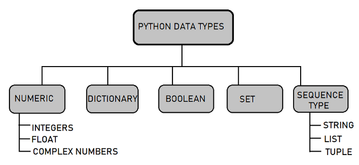

# python notes:

## Resources:
* [Python Essential Training](https://www.linkedin.com/learning/python-essential-training-14898805)

## What is Python?
[source:](https://twitter.com/DanKornas/status/1587332107516317697)
<p align="center">
    
</p>

<p align="center">
    
</p>

## Python Operators
```python
# Arithmetic Operators:
2 + 3     # Addition
4 - 2     # subtraction
4 * 2     # multiply
4 / 2     # float div
4 // 3    # floor/int div: returns 1

# Comparison Operators:
2 > 3     # greater than
2 < 3     # less than
2 >= 3    # greater than or equal to
2 <= 3    # less than or equal to
2 != 3    # not equal to
2 == 3    # equal to

# Logical Operators:
x = True
y = False
x and y   # False
x or y    # True
not x     # False
not y     # True

# Bitwise operators: Need to learn about it more

# Membership Operators:
# used to check something in another thing using: 'in'
x = 'Python Course'
y in x         # returns True
a in x         # returns False

# Identity Operators:
# To check if two things are identical or not using: 'is' and 'is not'
x=5
y=5
z='a'
x is y          # True
y is not z      # True
x is z          # False
```


## Some useful python functions to know:
<hr>

#### `zip()` Make an iterator that aggregates elements from each of the iterables
```python
## using zip method to combine lists & also to extrac them back
country = ['Argentina', 'Portugal', 'France', 'Brazi']
player = ['Messi', 'Ronaldo', 'Mbappe', 'Neymar']
goals = [200, 300, 250, 400]
combined_data = list(zip(country, player, goals))
combined_data

[('Argentina', 'Messi', 200),
 ('Portugal', 'Ronaldo', 300),
 ('France', 'Mbappe', 250),
 ('Brazi', 'Neymar', 400)]

# to retrieve the data back
c,p,g = zip(*combined_data)
c
('Argentina','Portugal','France','Brazil')
```

#### `nlargest()` and `nsmallest()` To find N-Largest & N-Smallest values from an iterable. It returns a list.
```python
import heapq
values = [1,2,3,100,101,102]

# print 3 largest
print(heapq.nlargest(3, values))
>>> [102, 101, 100]

# print 3 smallest
print(heapq.nsmallest(3, values))
>>> [1,2,3]
```

#### `any()` and `all()` Return True depending on situations
```python
values = [True, True, True]
alt_values = [False, True, True]

# if all values True, all returns true, else false
print(all(values))
>>> True

print(all(alt_values))
>>> False

# any will return True if any value is True, else False
print(any(values))
>>> True

print(any(alt_values))
>>> True
```

#### `enumerate()` Return both counter and iterator from iterables
```python
player = ['Messi', 'Ronaldo', 'Neymar']

for counter, name in enumerate(player, start=1): # start can be from 0, if set
    print(f"{counter}. {name}")

# output
1. Messi
2. Ronaldo
3. Mbappe
4. Neymar
```

#### `"".join()` inbuilt string function to join string elements
```python
# Joining with empty separator
list1 = ['g', 'e', 'e', 'k', 's']
print("".join(list1))
 
# Joining with string
list1 = " geeks "
print("$".join(list1))

# output
geeks

intro = ["Hello", "my", "name", "is", "Shyam"]
combined_string = " ".join(intro)  # joining with space in between
print(combined_string)

>>> 'Hello my name is Shyam'
```
