>Pandas is a tool or package that helps you deal with the datasets (in csv, json, excel, ...), you can quickly see what are the columns, what data types are stored, and what you can do with it by cleaning and formatting that it can be ready to use later for the machine-learning algorithms. Pandas are built on top of numpy.

>The reason to use pandas can be see below where we compare the numpy with pandas. Each column of pandas is an array (pandas call it Series object). The convinence of indexes and column names makes selecting elements more straightforward in pandas than in numpy. Instead of using numbers (need to look up about it), we can use strings/labels to look up or select elements, which makes it so much easier for this task. We can even use indexes to merge different datasets.

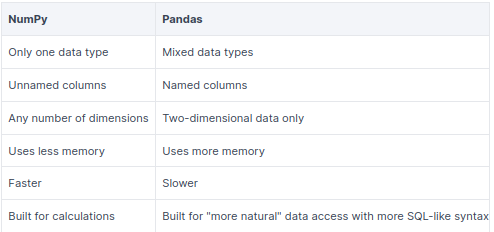

# :panda_face: pandas notes :blue_book:

## install pandas using pip
```bash
pip install pandas
```

## Create DataFrame (df) from Numpy:
```python
# create your first dataframe (df)
df = pd.DataFrame(
    np.array([
        [1,2],
        [3,4]
    ]),
    columns=['col1', 'col2']
)
print(df)
>>>    col1  col2
    0     1     2
    1     3     4

```

## Create Pandas Series from python list:
A Series is a one-dimensional array of indexed data.
```python
import pandas as pd

pandas_series = pd.Series(
    [1, 2, 3, 4],  # Python list
    index=["a", "b", "c", "d"]  # Python list
)
print(pandas_series)
>>> a    1
    b    2
    c    3
    d    4
    dtype: int64

```

>Let's see the difference between Series and DataFrame.

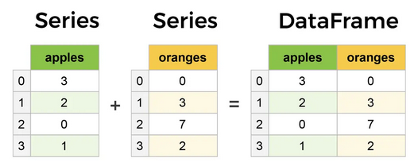

## Load the `csv` File into df:
```python
import pandas as pd                        # standard to use pd alias
import numpy as np                         # guaranteed to be needed
pd.show_versions()                         # shows versions of dependencies of pandas
pd.set_option('display.max_columns',85)    # to see 85 columns
pd.set_option('display.max_columns', None) # to display all colns (whatever)
pd.set_option('display.max_rows',85)       # to see 85 rows
# Don't show numbers as scientific notation
pd.set_option("display.float_format", "{:.2f}".format)

df = pd.read_csv('/path/to/data/file', index_col='col_name')
```

> See [here](https://pandas.pydata.org/docs/user_guide/io.html) for docs to see what different kinds of files pandas can load as dataframe, and also to see all the functionalities for each kinds of loads of the files.

## Load the *pickle* and *parquet* files into df:
```python
# Read a Python Pickle file
df_list = pd.read_pickle("listings_content.pkl")

# Read a PyArrow Parquet file
df_cal = pd.read_parquet("calendar_content.parquet", engine="pyarrow")
```

## inspecting the df
```python
df.head()      # prints first 5 rows of df
df.head(10)    # first 10 rows
df.tail()      # prints last 5 rows of df
df.dtypes      # returns the data types of all cols in df
df.shape       # shows the (rows,columns) numbers in tuple form
df.columns     # gives list of all columns names
df.columns.tolist()    # get the col names and make a list
df.index       # to see the names of index
df.info()      # shows more info, including dtypes of each column, non-null rows
df.info(verbose=True, show_counts=True)  # to make sure Non-Null cols show up
df.describe()  # quick statistical overview of numerical cols
df['categorical_col'].describe()   # to see describe works for Obj col
df.to_string() # render a df to a console-freindly tabular output
df.values      # gives us data only w/o index and cols, like numpy matrix

# copying df, and then working on copy
df_copy = df.copy()
```

## Selecting *Only* One Column:
```python
df['col_name']    # column name is string type (Object)
                  # preferred way
                  # returns Sereis Object
df[['col_name']]  # double brackets returns df Object
df.col_name       # works if col_name has no spaces

# also using loc or iloc
df.loc[:, 'col_name']
```
>Slicing with `loc` is inclusive, while slicing with `iloc` is exclusive for the end.

## Selecting Multiple Columns:
```python
df[['col1','col2','col3']]  # pass list of columns

# using loc:
df.loc[:, ['col1', 'col2', 'col3']]

# using loc slicing:
df.loc[:, 'col1':'col3']

# using iloc:
df.iloc[:, [0,3,5]] # all rows, specified cols

# using iloc slicing:
df.iloc[:, 0:5]     # all rows, first 5 cols
```
>Generally, if there are few typos that doesn't have any pattern in them, then it is better to access those values, and manually update them. But, if there are lots of typos and errors that have some pattern in them, then we can even use powerful methods like using `regex` to deal with it. Read [here](https://kanoki.org/2019/11/12/how-to-use-regex-in-pandas/) for more details on *regex in pandas*.

## access row(s) using `.loc[]` or `.iloc[]`
`iloc[]` is integer indexer. It needs integer to index rows. `loc[]` is more versatile in that it can acess rows based on labels, and that is easier most of the time. Nonetheless, both are important.
```python
# iloc search by integers
df.iloc[0]                     # gives first row; return Series Object
df.iloc[0:5, 0:5]              # gives 5 rows & 5 columns; returns df
df.iloc[[0,1,5,20],[2,4,9]]    # access specfic rows and columns

# loc search by labels
df.loc['row1']                            # if you want first row as above; return Series
df.loc['row1':'row5']                     # first 5 rows
df.loc['row1':'row5', 'col1':'col5']      # return first 5 rows and 5 columns
df.loc[['row1','row4'],['col1','col6']]   # return specified rows & cols
```

>Data preparation accounts for [about 80\% of the work](https://www.forbes.com/sites/gilpress/2016/03/23/data-preparation-most-time-consuming-least-enjoyable-data-science-task-survey-says/?sh=532dd6346f63) of a Data Scientist.

## methods for a single column (Basic Analysis):
```python
# default setting of value counts
# if your df has significant amounts of Null values, then you may want to
# count Null values as well, so setting dropna=False
df['col'].value_counts(normalize=False, sort=True, ascending=False,
                      bins=None, dropna=True)

df['col1'].value_counts(normalize=True)   # counts the number of unique values
                                          # best for categorical data types
df['col'].unique()                        # returns list of unique values in col
df['col'].replace('old_value','new_value', inplace=True)
df['col'].fillna('fill_value', inplace=True)
```

>Tips: Check to see each methods of pandas if we can apply to both the Series object and to DataFrame object. Example, `.sort_values()` can be applied to both the Series and DataFrame objects. And, so we can learn more this way if we are aware of these methods and how they function applied into various situations.

>Other related functions:

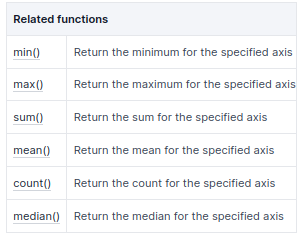

## work with index
```python
df.set_index('col_name', inplace=True)         # set col_name as index of df
                                               # col_name has to be in df
df.reset_index(inplace=True)                   # removes index and keep as col
                                               # default to 0,1,2,... index
df.sort_index(inplace=True)                    # sorts index ascending by default
df.sort_index(ascending=False, inplace=True)   # sorts index descending
```

## filtering using conditionals - filter rows and columns
```python
df[df['col_1']=='some_value']                      # filter df such that we only see where col_1==some_value
df.loc[df['col_1']=='some_value']                  # same as above, but using .loc
df.loc[df['col_1']=='some_value', ['col2','col3']] # .loc has little advantages

## using multiple conditions using & and |
df[(df['col_1']=="some_value") & (df['col_3']=="some_other_value")]
df[(df['col_1']=="some_value") | (df['col_3']=="some_other_value")]

# example 
df[(df.Medal == 'Gold') & (df.Gender == 'Women')]

## using loc with multiple filter condition
df.loc[(df['col_1']=="some_value") & (df['col_3']=="some_other_value"), ['col2','col5']]
df.loc[(df['col_1']=="some_value") | (df['col_3']=="some_other_value"), ['col2','col5']]

## filter using .isin()
# make a list of filter values that are in a column of interest
list_of_values = ['value1', 'value2', 'value3', 'value4', 'value5']
filt = df['col_of_interest'].isin(list_of_values)    # first create filter
df.loc[filt, ['col1', 'col2', 'col4']]               # apply filter to df

## filter using string method
# let's say your col values are strings, then you can use string method on them to filter
filt = df['col'].str.contains('Python', na=False)  # if that col value contains Python
df.loc[filt, ['col1', 'col2', 'col3']]
```
**Tips**: If you want all the cases where the filter didn't match you can just put tilde `~` sign infront of the filter.

## String handling:
* Available to every Series using `str` attribute
* `Series.str` -> access values of series as strings and apply several methods to it. For example:
    * Series.str.contains()
    * Series.str.startswith()
    * Series.str.isnumeric()
```python
# trying to look into Athelete column that contains string 'Florence' anywhere
oo[oo.Athlete.str.contains('Florence')]
```

## modifying/updating df as need
```python
# replace all spaces in col names with underscore
df.columns = df.columns.str.replace(" ", "_")

# rename only columns we want to
df.rename(columns={'old_col1_name':'new_col1_name',
                  'old_col2_name':'new_col2_name',
                  'old_col3_name':'new_col3_name'}, inplace=True)

# update data in rows,col
df.loc['row_label', ['col1','col2']] = ['value1', 'value2']   # for single row
```

### update df using `apply`
```python
df['email'].apply(len)    # gives the length of each value in email column

# apply user defined function to apply
def update_email(email):
    return email.upper()

df['email'].apply(update_email)

# using lambda fun
df['email'].apply(lambda x: x.lower())  # changes all values to lower case

# apply to df applies to Series
df.apply(lambda x: x.min())    # here x variable will be Series Object
```

### update using `applymap`
Using `apply` on Series applies to each values in Series. Similarly, using `apply` on whole dataframe applies to each column i.e. Series objects. But, if we want to use `apply` on each values in a whole df, then we need to use `applymap`.
```python
df.applymap(len)   # here len function is applied to each values in df
```

### update using `map`
`map` method works only on Series. It is used to substitue values with another values in a Series.
```python
df['col'].map({'old_val1':'new_val1', 'old_val2':'new_val2'})
```

## Update using `replace`:
```python
# replace categorical values with another values:
# we want to change to True and False to strings 't', and 'f' in df
df['col'] = df['col'].replace({"string t in df col": True,
                              "str f in df col": False}).astype("bool")

# replace string obj. using string operations
# We want to replace $45,000, $ and comma (,) from prices, then convert to float
df['col'] = df['col']
            .str.replace("$", "", regex=True)
            .str.replace(",", "", regex=True)
            .astype("float")
```

There are great docs available for such string object column, see [here](https://pandas.pydata.org/docs/reference/api/pandas.Series.str.capitalize.html). Also, let's see some more of these string methods.

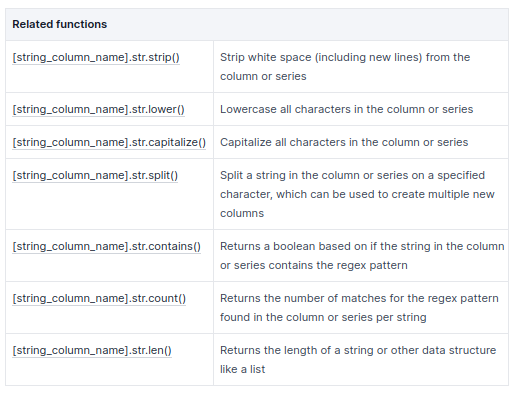

## Add/Remove Rows and Columns
```python
## cols:
## Adding columns
df['new_col'] = df['old_col'] * 1.10             # if old_col from df is a numeric type

# split full name to first and last and add to df
df[['first','last']] = df['full_name'].str.split(" ", expand=True)

## removing col
df.drop(columns=['col1','col2'], inplace=True)

## rows:
# add a single row
df.append({'col':'value'}, ignore_index=True)  # not very useful, only changes few col values that we specify

# append another df2 to df
df.append(df2, ignore_index=True)    # finds matching col names to put the values

# concatenate df
pd.concat([df1, df2], axis=1)       # concatenate by column

# remove rows
df.drop(index=2)    # drops index 2

# drop using conditions
df.drop(index=df[df['col']=='value'].index)  # the last index is because we need index from df to drop
```

## Sorting data
```python
df.sort_values(by='col_name', ascending=False)  # sorted by col_name
df.sort_values(by=['col1','col2'])              # if col1 has duplicates, it then looks col2 to sort

# diff col has diff way of sorting
df.sort_values(by=['col1','col2'], ascending=[False, True], inplace=True)

# sort by index
df.sort_index()           # see df sorted by index
df['col'].sort_values()   # returns Series sorted by col

# nlargest & nsmallest
df['col'].nlargest(10)    # displays 10 largest value in col
df.nlargest(10, 'col')    # returns df with 10 largest in col
df.nsmallest(10, 'col')   # same deal, now smallest
```

## Grouping and Aggregating
```python
# median for single col
df['col'].median()      # returns median value from col

## median by country -- group
# groupby does --> split, apply func, combine result
country_grp = df.groupby(['Country'])  # this groups df by Country
country_grp.get_group('United States') # get just one group

# apply func
df.groupby('Country')['col'].value_counts()  # each country's specific col value counts
df.groupby('Country')['Salary'].median()     # for each country, select salary col, then calculate median

# apply method need for Series Object
# for each country, look into LanguageWorkedWith col, and calculate total nb if
# it contains Python
df.groupby('Country')["LanguageWorkedWith"].apply(lambda x: x.str.contains('Python').sum())

# multiple agg func
# In addition to median, also calculate mean
df.groupby('Country')['Salary'].agg(['median', 'mean'])

## median to df
df.median()   # calculates median of all numeric col
df.describe()  # more stats of numeric cols
```
>`.apply()` method in its inner working, actually in not so much efficient, it uses for loop. If we want to vectorize and make faster to use `apply` and `lambda` function, then you can read [here](https://towardsdatascience.com/do-you-use-apply-in-pandas-there-is-a-600x-faster-way-d2497facfa66).

> `inplace=True` should be avoided, if you can, [read this](https://towardsdatascience.com/why-you-should-probably-never-use-pandas-inplace-true-9f9f211849e4).

### More GroupBy Tricks:
--> From [towardsdatascience.com page by Suraj Gurav](https://towardsdatascience.com/5-pandas-group-by-tricks-you-should-know-in-python-f53246c92c94).

In Pandas, `groupby` splits all the records from the dataset into different categories or groups and we can then analyze the data by these groups. `groupby()` function applied on any categorical column will return `GroupBy` object. Then we can use different methods on this object and even aggregate other columns to get the summary view of the dataset.

The groupby object is like a dictionary where keys are the unique groups and values are the columns of df that was not mentioned in groupby. Just like dictionary, there are several methods to get the required data efficiently.

The number of groups should be equal to the number of unique values that you called `groupby` on.
```python
# We can iterate through groupby object:
for group_key, group_value in oo.groupby('Edition'):
    print(group_key)
    print(group_value)

df_group = df.groupby("categorical_col")
type(df_group)
>>> pandas.core.groupby.generic.DataFrameGroupBy

## to get the number of groups
df_group.ngroups
>>> # nb of groups (from above)

## to know the size of each group
df.groupby('cat_col').size()    # shows how many rows in each group
df.groupby('cat_col').count()   # shows non-null values in each col

## how to get the first, last, or any row from each group
df.groupby('cat_col').first()  # shows first row for each group
df.groupby('cat_col').last()   # shows last row for each group
df.groupby('cat_col').nth(3)   # access 4th row (0-indexing)

## how to extract/select just one group from groupby obj
df_group.get_group('group_value_to_look')
# this getting group can be used in replace to slicing the dataframe
df[df['cat_col']=='Home']
# same as
df_group = df.groupby("cat_col")
df_group.get_group('Home')  # much faster this way

## Aggregate Multiple Columns with Different Aggregate Functions:
# This is the most use case of groupby
df.groupby('categorical_col')[['col1','col2']].mean()
# above, we applied mean function to col1 and col2
# other agg func: min(), max(), count(), median(), std()

# we can apply multiple agg func on same col or on different cols
# applying multiple agg func on same column
df.groupby('cat_col')[['col1']].aggregate([min, max, sum, 'mean'])  
# this will give statistics about col in each group

# first groupby multiple cols, and for the remaining cols, find 
# min, max, count aggregates
oo.groupby(['Edition','NOC','Medal']).agg(['min','max','count'])

# only one col: Edition gets the aggreagte to be applied
oo.groupby(['Edition','NOC','Medal']).agg({'Edition' :['min','max','count']})

## apply multiple columns different func
df.groupby('cat_col').aggregate({'col1':'count', 'col2':'mean'})
```

## Cleaning Data, `NaN`, `None`, Wrong Types, and Unusable Formats:
See the figure below [from Kaggle source](https://www.kaggle.com/code/parulpandey/a-guide-to-handling-missing-values-in-python), how we can approach to clean data/columns depending on different situations. There is a difference between `NaN` and `None`. *NaN* means "not a number", referring to an undefined number, but it still allows us to perform calculations on the column with these values. This is not the case for *None*, which is just missing data and should only be used when dealing with **object** data types. We always, almost want to change the *None* to *Nan*.

>To use `interpolate()` see [here](https://www.analyticsvidhya.com/blog/2021/06/power-of-interpolation-in-python-to-fill-missing-values/) for quick overview to use it.

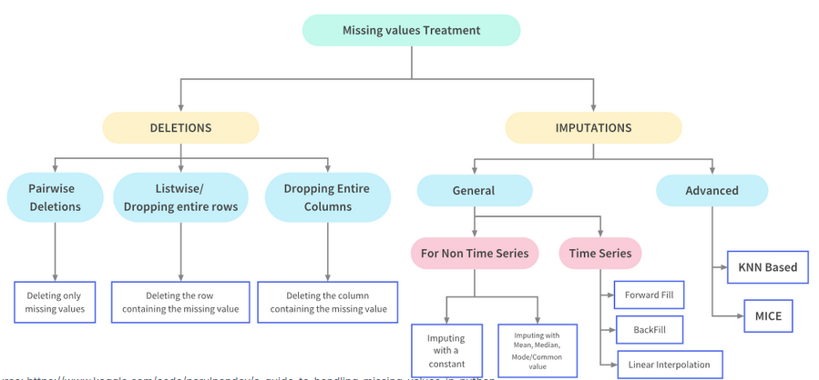
```python
## make a list of columns in df that has any one of its values as nan
df.columns[df.isnull().any()].to_list()

## see how interpolate works
# Forward fill is the default approach for interpolate
df_cal["maximum_nights"] = df_cal["maximum_nights"].interpolate()

## if we just want to remove missing value
df.dropna(axis='index', how='any')   # default arguments; it removes np.nan, None

# drop if value in one of col is missing
df.dropna(axis=0, how='any', subset=['col'])

# to completely drop the columns
df.drop(columns=['col1', 'col3', 'col4'], inplace=True)

# if df has custom missing values, replace it with np.nan
df.replace('NA', np.nan, inplace=True)

df.isna()   # returns mask/filter whether values are nan

df.fillna('MISSING')  # fills np.nan with MISSING
df.fillna(0)          # fills np.nan with zero

df['col'].fillna(0, inplace=True)  # fill col with 0
col_mean = df['col'].mean()
df['col'].fillna(col_mean, inplace=True)  # fill with mean value of col

## cast dtype of col
df['col'].astype(int)     # convert col to int dtype
df['col'].astype(float)   # convert col to float dtype

## replace missing values while reading csv
# first create what are missing values inside df are
na_vals = ['NA', 'Missing', 'NAN', 'NONE', 'MISSING']
df = pd.read_csv('path/to/csv', index_col='col1', na_values=na_vals)
```
>Some more related functions:

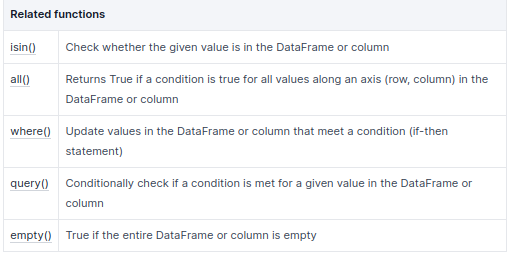

## Dates and Time Series data
```python
# convert string of col to datetime obj
df['col'] = pd.to_datetime(df['col'])      # convert col to datetime obj, if compatible
df['col'] = df['col'].astype('datetime64') # using astype() casting

# explicitly telling how our col is formatted as datetime in original string
df['col'] = pd.to_datetime(df['col'], format='%Y-%m-%d %I-%p')

# running methods now to converted datetime object
df['date_col'].dt.day_name()    # returns the day of the week of each dates

# to see earliest date
df['date_col'].min()

# to see latest date
df['date_col'].max()

# to do time-delta (time betweent two times)
df['date_col'].max() - df['date_col'].min()

# filters by date, let's say we want to view just 2020
filt = (df['date_col'].dt.year >= '2020') & (df['date_col'].dt.year < '2022')
df.loc[filt]

# not just year but all some datetime obj
filt = (df['date_col'] >= pd.to_datetime('2019-01-01')) & (df['date_col'] < pd.to_datetime('2020-01-01'))
df.loc[filt]

# good idea to set index to datetime obj
df.set_index('date_col', inplace=True)

# slice df with help of index of datetime obj, now
df.loc['2020-01':'2020-02']

# resample df using other col, but using dateobject col as well
df['other_col'].resample('D').max()  # resample by Day and give max for each group

# resample using multiple columns
df.resample('D').mean()  # gives mean value for each col, on Daily basis
df.resample('W').agg({'col1':'mean', 'col2':'max', 'col3':'min', 'col4':'sum'})
```
**Tips**: We can also load the csv with datetime object formatted during the load-time only. See if you like that way also.

## Merging DataFrames:
* DataFrames might be reperesented in one of the two formats i.e. wide or long. Most preferrably, we want the wide df most of the time. See [here](https://www.statology.org/long-vs-wide-data/#:~:text=A%20dataset%20can%20be%20written,repeat%20in%20the%20first%20column.&text=Notice%20that%20in%20the%20wide,the%20first%20column%20is%20unique.) to learn more.
* To learn various `aggfunc` that are available to use in `groupby` or other pandas method. See [here](https://datascientyst.com/list-aggregation-functions-aggfunc-groupby-pandas/).

There are various types of joins we can think of. See below.


`pd.merge()` method is mostly used for these type of tasks. It implements number of types of joins: the *one-to-one, many-to-one,* and *many-to-many* joins.

```python
# concatenating two df stacking manner, fixing index as well
pd.concat((df1, df2), axis=0, ignore_index=True)
# vertical join, meaning column wise, side-by-side
pd.concat((df1, df2), axis=1, ignore_index=True)
```

### One-to-One joins, many-to-one, many-to-many:
The simplest type of joins is this one. This can also be achieved by column-wise concatenation. Let's say we have two dataframes as shown:

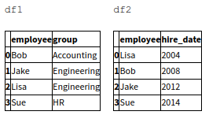

Then, we can simply combine these two dfs using `merge()` method. Notice, the common columns 'employee' doesn't have to be aligned exactly, orders can be anywhere, but the method manages to find it. Also, the default behavior of *merge* is not to use index.
```python
# for all the types of joins here we have the same codes
df3 = pd.merge(df1, df2)
df3
```
Output looks like this:

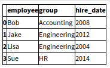

### Specifying using the Merge Key
The default behavior of `pd.merge()` is to find the common columns from dfs and use those columns as the keys. But columns names may not be always same or match so nicely. We have other parameters to play with inside the `pd.merge()` for these cases.

* We can use `on` keyword as show below example:
```python
pd.merge(df1, df2, on='employee')
```

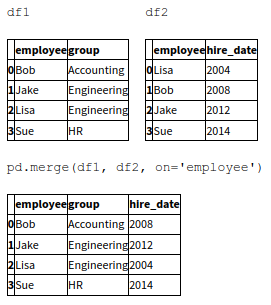

* Using `left_on` and `right_on` keywords.
If we wanted to merge dfs that has different column names in both dfs.
```python
pd.merge(df1, df3, left_on='employee', right_on='name')

# since result has redundant cols, we can drop on of them
pd.merge(df1, df3, left_on="employee", right_on="name").drop('name', axis=1)
```

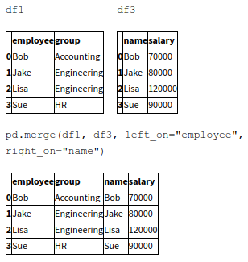

* merging on `left_index` and `right_index`
Sometimes, you have to merge using dfs indexes.
```python
pd.merge(df1a, df2a, left_index=True, right_index=True)
```

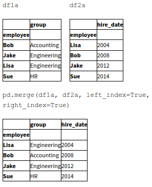

* Other times you might need to use both index and column to join
```python
pd.merge(df1a, df3, left_index=True, right_on='name')
```

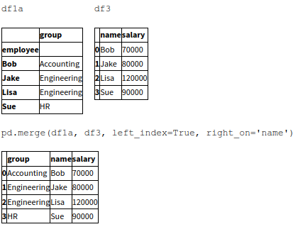

### Specifying Set Arithmetics for Joins: inner, outer:
These situations comes when values appears in one key column, but not on the other key column of other df. What to do then, which one to keep, left or right df? By default, the joins between dfs are `inner` i.e. merge will only keep rows where values matches in both the dfs we are trying to merge. See below:

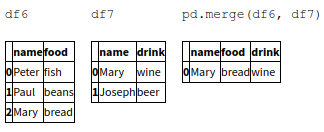

Here we can see only the row with 'Mary' is kept because that value is only the common value. We could specify the type of joins (although default is inner)
```python
pd.merge(df6, df7, how='inner')
```

Other options are: `outer, left, right`. Outer will return total, even no values in one or other df, it will put nan there. Let's see one example for each of other types:

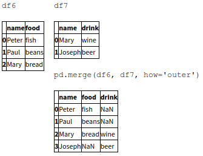

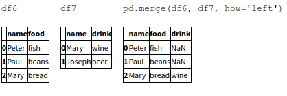

### Overlapping column names in dfs
What if both dfs has many column names exact, then how will we distinguish when merged which columns are coming from which df? `merge()` will automatically put `_x` and `_y` at the end of the conflicting column names but we can provide our own.
```python
pd.merge(df8, df9, on="name", suffixes=["_L", "_R"])
```

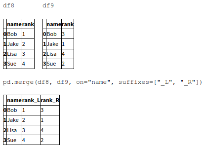

## Reading/Writing Data - other sources like excel, json, etc.
```python
# csv file
pd.read_csv('path/to/file')               # many helpful arguments you need to learn
new_df.to_csv('new_name.csv')             # to write your modified df into csv file
new_df.to_csv('new_name.tsv', sep='\t')   # tab separated csv

# excel
# first install packages
pip install xlwt openpyxl xlrd
# to write to excel
new_df.to_excel('new_name.xlsx')
# to specific sheet also you can do
# to read excel file
xcel_df = pd.read_excel('new_name.xlsx', index_col='col')

# json
new_df.to_json('new_name.json')
json_df = pd.read_json('new_name.json')

# from url
url_df = pd.read_csv("url_website")
```

## Resources:

* [pandas cheatsheet](https://github.com/pandas-dev/pandas/blob/main/doc/cheatsheet/Pandas_Cheat_Sheet.pdf)
* [Corise: Python for Data Science](https://corise.com/course/python-for-data-science)
* [Comprehensive data exploration with Python](https://www.kaggle.com/code/pmarcelino/comprehensive-data-exploration-with-python/notebook)
* [Comprehensive Data Analysis with Pandas](https://www.kaggle.com/code/prashant111/comprehensive-data-analysis-with-pandas/notebook)
* [Data Cleaning](https://www.kaggle.com/learn/data-cleaning)
* [Python Data Science Handbook](https://jakevdp.github.io/PythonDataScienceHandbook/).
* [Pandas Essential Training (LinkedIn)](https://www.linkedin.com/learning/pandas-essential-training/)


