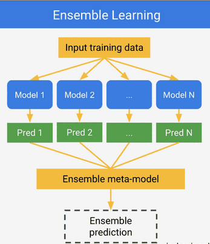
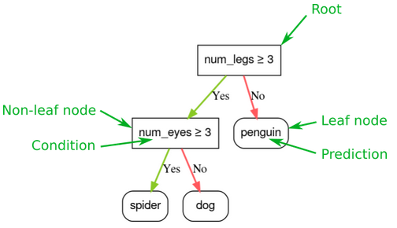
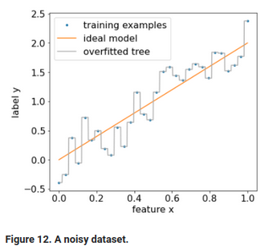
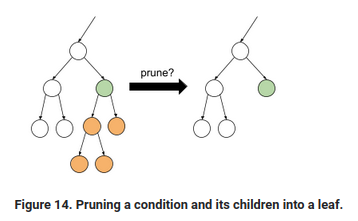
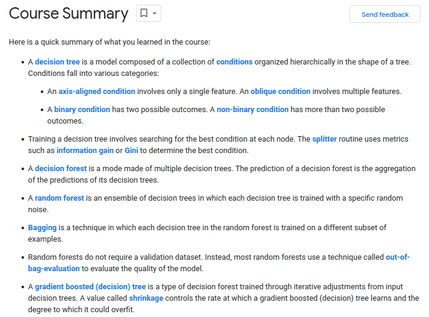

# :books: Notes on ML practices :books:

Machine learning gives computers ability to learn from data without being explicity programmed to do so. This is done by training the code on large amount of data and then from this learning make some predictions on new data. Since our computers are now fast enough and powerful to deal with big data, we can now achieve this and so the field has increased interest lately. Because now computers are fast and algorithms are improved so it predicts faster and do lots of work previously could not achieve. In basic terms, ML is the process of training a piece of software, called a model, to make useful predictions from data. An ML model represents the mathematical relationship between the elements of data that an ML system uses to make predictions.

## Types of ML systems:
* Supervised Learning
* Unsupervised Learning
* Reinforcement Learning

## Supervised Learning
Supervised learning models can make predictions after seeing lots of data with the correct answers and then discovering the connections between the elements in the data that produce the correct answers. This is like a student learning new material by studying old exams that contain both questions and answers. Once the student has trained on enough old exams, the student is well prepared to take a new exam. These ML systems are “supervised” in the sense that a human gives the ML system data with the known correct results. It is a type of ML algorithm where labeled training data is used to train or learn a function that maps the input data to the desired output. Example include if we have image classification task, we have 1000s of rows of data where each row is one image feature and also has the label to tell algorithm what picture it is. Then, this is supervised learning in that we have label output already to learn from and apply the learning to the newer dataset. Supervised learning task can be used for **classification, regression, and predictions**. Some of the common algorithm used in Supervised learning are:
* decision trees,
* support vector machines,
* neural nets., etc

To understand the core concepts of Supervised learning. We need to understand the following, at least:
* **Data**
    - Data should be both large (many examples) and diverse for it to be ideal. Also, datasets should have enough feature columns, not too many because, redundant features or features that don't have association with the label don't really help to learn from it.
        - For instance, a dataset might contain 100 years worth of data, but only for the month of July. Using this dataset to predict rainfall in January would produce poor predictions. Conversely, a dataset might cover only a few years but contain every month. This dataset might produce poor predictions because it doesn't contain enough years to account for variability. Also
* **Model**
    - In supervised learning, a model is the complex collection of numbers that define the mathematical relationship from specific input feature patterns to specific output label values. The model discovers these patterns through training.
* **Training**
    - Before a supervised model can make predictions, it must be trained. To train a model, we give the model a dataset with labeled examples. The model's goal is to work out the best solution for predicting the labels from the features. The model finds the best solution by comparing its predicted value to the label's actual value. Based on the difference between the predicted and actual values—defined as the loss—the model gradually updates its solution. In other words, the model learns the mathematical relationship between the features and the label so that it can make the best predictions on unseen data. This gradual understanding is also why large and diverse datasets produce a better model. The model has seen more data with a wider range of values and has refined its understanding of the relationship between the features and the label. During training, ML practitioners can make subtle adjustments to the configurations and features the model uses to make predictions. For example, certain features have more predictive power than others. Therefore, ML practitioners can select which features the model uses during training. For example, suppose a weather dataset containstime_of_day as a feature. In this case, an ML practitioner can add or remove time_of_day during training to see whether the model makes better predictions with or without it.
* **Evaluating**
    - We evaluate a trained model to determine how well it learned. When we evaluate a model, we use a labeled dataset, but we only give the model the dataset's features. We then compare the model's predictions to the label's true values. Depending on the model's predictions, we might do more training and evaluating before deploying the model in a real-world application.
* **Inference**
    - Once we're satisfied with the results from evaluating the model, we can use the model to make predictions, called inferences, on unlabeled examples. In the weather app example, we would give the model the current weather conditions—like temperature, atmospheric pressure, and relative humidity—and it would predict the amount of rainfall.

## Linear Regression
A regression model predicts a numeric value. For example, a weather model that predicts the amount of rain, in inches or millimeters, is a regression model. It is widely used statistical method for modeling the relationship between a dependent variable and one or more independent variable. Here we try to find the line of best fit that accurately describes the relationship between the dependent and independent variables. The line of best fit is that line that minimizes the error between the predicted and the actual values. Example of use, predicting house prices given all the features of house, stock prices based on historical data, etc. Linear regression assumes that the relationship between the dependent and independent variables are linear. Any non-linear relationships can't be solved by this method, so in that case, we need to use other non-linear methods.

## Classification
Classification models predict the likelihood that something belongs to a category. Unlike regression models, whose output is a number, classification models output a value that states whether or not something belongs to a particular category. For example, classification models are used to predict if an email is spam or if a photo contains a cat. Classification models are divided into two groups: binary classification and multiclass classification. Binary classification models output a value from a class that contains only two values, for example, a model that outputs either rain or no rain. Multiclass classification models output a value from a class that contains more than two values, for example, a model that can output either rain, hail, snow, or sleet.


## Decision Trees
It is a type of supervised learning algorithm that can be used for classification and regression tasks. It works by dividing the data into smaller and smaller groups, based on the value of certain features, until each group is "pure", meaning all the data in the group belongs to the same class. The algorithm sets the rules to determine which features to use for dividing the data, aiming to maximize the "information gain" at each step. Once the decision tree has been trained on a dataset, it can be used to make predictions on new data by feeding it through the tree and following the branches based on the values of the features. Decision trees have several advantages, including the ability to handle both numerical and categorical data and the ability to interpret and visualize the rules used to make predictions. However, they can also be prone to overfitting and may not perform as well on complex or non-linear datasets.

## K-Nearest Neighbor
KNN is a popular and simple machine learning algorithm for classification and regression tasks. In KNN, the model makes predictions or decisions based on the similarity of new data to the training data. To make a prediction, the model calculates the distance between the new data and the training data, and selects the K training points that are closest to the new data. The model then uses the labels or outputs of the K nearest points to make the prediction or decision for the new data. KNN can be used for a variety of tasks, such as predicting the type of a flower based on its characteristics, or identifying the author of a piece of text based on their writing style. KNN can be sensitive to the choice of K and the distance metric, and it can perform poorly for high-dimensional or noisy data.


## Unsupervised Learning
Unsupervised learning models make predictions by being given data that does not contain any correct answers. An unsupervised learning model's goal is to identify meaningful patterns among the data. In other words, the model has no hints on how to categorize each piece of data, but instead it must infer its own rules. Unsupervised learning is a type of machine learning algorithm that uses unlabeled data to learn patterns and relationships in the data. The goal is to find structure and meaning in the data, without the guidance of labeled training data. Unsupervised learning algorithms can be used for a variety of tasks, such as clustering data into groups, identifying anomalies or outliers in the data, or reducing the dimensionality of the data. Some common unsupervised learning algorithms include k-means clustering, principal component analysis, and autoencoders. Unsupervised learning can provide valuable insights into the structure and relationships in the data, and can be used in combination with supervised learning to improve the performance of machine learning models. However, unsupervised learning can be challenging to apply and interpret, and it can be sensitive to the choice of algorithm and parameters.

## K-Means Clustering
K-means clustering is a popular and simple unsupervised learning algorithm for clustering data into groups. In K-means clustering, the goal is to partition the data into K clusters, where each cluster is defined by its center or centroid, and each data point belongs to the cluster with the closest centroid. To find the clusters, the K-means algorithm iteratively updates the centroids and assigns the data points to the closest centroids, until the centroids converge and the assignments of the data points do not change. To find the clusters, the K-means algorithm iteratively updates the centroids and assigns the data points to the closest centroids, until the centroids converge and the assignments of the data points do not change. K-means clustering is simple to implement and fast to run, and it can provide good results for many types of data. However, K-means clustering is sensitive to the choice of K and the initialization of the centroids, and it can perform poorly for non-linearly separable or non-uniformly distributed data.

## Reinforcement Learning
Reinforcement learning models make predictions by getting rewards or penalties based on actions performed within an environment. A reinforcement learning system generates a policy that defines the best strategy for getting the most rewards. Reinforcement learning is used to train robots to perform tasks, like walking around a room, and software programs like AlphaGo to play the game of Go. Reinforcement learning is a third type of ML, is a type of machine learning algorithm that uses a trial-and-error approach to learn how to maximize a reward or goal. In reinforcement learning, the model is an agent that interacts with an environment and takes actions to achieve a reward or goal. The agent receives feedback in the form of rewards or punishments, which it uses to update its decision-making strategy and improve its performance over time. Reinforcement learning can be used for a variety of tasks, such as playing games, controlling robots, or optimizing resource allocation. Some popular reinforcement learning algorithms include Q-learning, Monte Carlo methods, and deep reinforcement learning. Reinforcement learning is a powerful and flexible technique that can learn complex behaviors and adapt to changing environments. However, reinforcement learning can be difficult to apply and optimize, and it can require a lot of data and computational resources to achieve good performance. Overall, reinforcement learning is an exciting and promising area of machine learning that has the potential to solve many complex and challenging problems.

## Ensemble learning
Ensemble learning is a machine learning technique that combines multiple models to improve the performance and robustness of the final model.In ensemble learning, the individual models, called base models or weak learners, are trained on the same data, but the data input varies from model to model, and their predictions are combined using a combination rule, such as majority voting, averaging, or weighted averaging. Ensemble learning can be used for a variety of tasks, such as classification, regression, and clustering. Some common ensemble learning algorithms include bagging, boosting, and stacking. Ensemble learning can provide better performance and more robust predictions than individual models, and it can be used to reduce overfitting and improve the generalizability of the final model. However, ensemble learning can be computationally expensive, and it can require careful design and tuning of the base models and the combination rule.

<p align="center">
    
</p>

## Decision Trees
Decision forest models are composed of decision trees. Decision forest learning algorithms (like random forests) rely, at least in part, on the learning of decision trees. Decision trees are combined to train decision forests. Decision forests also Decision trees can be used for the supervised learning and used for both classification, and regression. A decision tree is a model composed of a collection of "questions" organized hierarchically in the shape of a tree. The questions are usually called a condition, a split, or a test. We will use the term "condition" in this class. Each non-leaf node contains a condition, and each leaf node contains a prediction. See an image below how a single tree forms with base (root) on the top and coming down to the leaf. Inference of a decision tree model is computed by routing an example from the root (at the top) to one of the leaf nodes (at the bottom) according to the conditions. The value of the reached leaf is the decision tree's prediction. The set of visited nodes is called the inference path. Most algorithms used to train decision trees work with a greedy divide and conquer strategy. The algorithm starts by creating a single node (the root) and recursively and greedily grows the decision tree. At each node, all the possible conditions are evaluated and scored. The algorithm selects the "best" condition, that is, the condition with the highest score. For now, just know that the score is a metric that correlates with the task, and conditions are selected to maximize that metric. When no satisfying conditions are found, the node becomes a leaf. The leaf prediction is determined as the most representative label value in the examples.

<p align="center">
    
</p>

### Overfitting and Pruning:

<p align="center">
    
</p>

The following figure shows a noisy dataset with a linear relation between a feature x and the label y. The figure also shows a decision tree trained on this dataset without any type of regularization. This model correctly predicts all the training examples (the model's prediction match the training examples). However, on a new dataset containing the same linear pattern and a different noise instance, the model would perform poorly. To limit overfitting a decision tree, apply one or both of the following regularization criteria while training the decision tree:
* Set a maximum depth: 
Prevent decision trees from growing past a maximum depth, such as 10.
* Set a minimum number of examples in leaf: 
A leaf with less than a certain number of examples will not be considered for splitting.

You can also regularize after training by selectively removing (pruning) certain branches, that is, by converting certain non-leaf nodes to leaves. A common solution to select the branches to remove is to use a validation dataset. That is, if removing a branch improves the quality of the model on the validation dataset, then the branch is removed. The following drawing illustrates this idea. Here, we test if the validation accuracy of the decision tree would be improved if the non-leaf green node was turned into a leaf; that is, pruning the orange nodes.

<p align="center">
    
</p>

### Variable importance
Variable importance (also known as feature importance) is a score that indicates how "important" a feature is to the model. For example, if for a given model with two input features "f1" and "f2", the variable importances are {f1=5.8, f2=2.5}, then the feature "f1" is more "important" to the model than feature "f2". As with other machine learning models, variable importance is a simple way to understand how a decision tree works.

### Decision Tree example with TensorFlow:
```python
# first install if not installed
!pip install tensorflow_decision_forests

# import required libraries
import numpy as np
import pandas as pd
import tensorflow_decision_forests as tfdf

# let's do the classification problem of Parlmer Penguins that contains 3 types of Penguins features

# import dataset
path = "https://storage.googleapis.com/download.tensorflow.org/data/palmer_penguins/penguins.csv"
pandas_dataset = pd.read_csv(path)

# Display the first 3 examples.
pandas_dataset.head(3)

# The full dataset contains a mix of numerical (for example, bill_depth_mm), categorical (for example, island),
# and missing features. Unlike neural networks, decision forests support all these feature types natively, 
# so you don't have to do one-hot encoding, normalization, or extra is_present feature.

# let's convert class labels into integers to easily classify
label = "species"

classes = list(pandas_dataset[label].unique())
print(f"Label classes: {classes}")
# >> Label classes: ['Adelie', 'Gentoo', 'Chinstrap']
pandas_dataset[label] = pandas_dataset[label].map(classes.index)

# split dataset into train-test
np.random.seed(1)
# Use the ~10% of the examples as the testing set
# and the remaining ~90% of the examples as the training set.
test_indices = np.random.rand(len(pandas_dataset)) < 0.1
pandas_train_dataset = pandas_dataset[~test_indices]
pandas_test_dataset = pandas_dataset[test_indices]

print("Training examples: ", len(pandas_train_dataset))
# >> Training examples: 309

print("Testing examples: ", len(pandas_test_dataset))
# >> Testing examples: 35


# Training with default parameters, because why not, default is already a good place to start
tf_train_dataset = tfdf.keras.pd_dataframe_to_tf_dataset(pandas_train_dataset, label=label)
model = tfdf.keras.CartModel()
model.fit(tf_train_dataset)
# The preceding call to tfdf.keras.CartModel did not specify columns to use as input features.
# Therefore, every column in the training set is used. The call also did not specify the semantics 
# (for example, numerical, categorical, text) of the input features. Therefore, tfdf.keras.CartModel 
# will automatically infer the semantics.

# to display resulting decision tree
tfdf.model_plotter.plot_model_in_colab(model, max_depth=10)

# to evaluate train test accuracy
model.compile("accuracy")
print("Train evaluation: ", model.evaluate(tf_train_dataset, return_dict=True))
# >> Train evaluation:  {'loss': 0.0, 'accuracy': 0.96116}

tf_test_dataset = tfdf.keras.pd_dataframe_to_tf_dataset(pandas_test_dataset, label=label)
print("Test evaluation: ", model.evaluate(tf_test_dataset, return_dict=True))
# >> Test evaluation:  {'loss': 0.0, 'accuracy': 0.97142}

# To train a better model, optimize the hyperparameters with the Keras tuner.

# Important note: Don't tune hyperparameters on the test dataset. Instead, tune hyperparameters on a separate 
# validation dataset (on large datasets) or using cross-validation (on small datasets). 
# For simplicity, this course uses the test dataset for tuning.

!pip install keras-tuner

import keras_tuner as kt

def build_model(hp):
  model = tfdf.keras.CartModel(
      min_examples=hp.Choice("min_examples",
          # Try four possible values for "min_examples" hyperparameter.
          # min_examples=10 would limit the growth of the decision tree,
          # while min_examples=1 would lead to deeper decision trees.
         [1, 2, 5, 10]),
      validation_ratio=hp.Choice("validation_ratio",
         # Three possible values for the "validation_ratio" hyperparameter.
         [0.0, 0.05, 0.10]),
      )
  model.compile("accuracy")
  return model

tuner = kt.RandomSearch(
    build_model,
    objective="val_accuracy",
    max_trials=10,
    directory="/tmp/tuner",
    project_name="tune_cart")

tuner.search(x=tf_train_dataset, validation_data=tf_test_dataset)
best_model = tuner.get_best_models()[0]

print("Best hyperparameters: ", tuner.get_best_hyperparameters()[0].values)
# >> Best hyperparameters:  {'min_examples': 2, 'validation_ratio': 0.0}
# The candidate values of the hyperparameter (for example, [1,2,5,10] for min_examples) depend on your 
# understanding of the dataset and the amount of computing resources available.

# let's see improvements with optimized hyperparameters
model = tfdf.keras.CartModel(min_examples=2, validation_ratio=0.0)
model.fit(tf_train_dataset)

model.compile("accuracy")
print("Test evaluation: ", model.evaluate(tf_test_dataset, return_dict=True))
# >> Test evaluation:  {'loss': 0.0, 'accuracy': 1.0}

# see how this model did better
tfdf.model_plotter.plot_model_in_colab(model, max_depth=10)
```
As mentioned earlier, a single decision tree often has lower quality than modern machine learning methods like random forests, gradient boosted trees, and neural networks. However, decision trees are still useful in the following cases:
* As a simple and inexpensive baseline to evaluate more complex approaches.
* When there is a tradeoff between the model quality and interpretability.
* As a proxy for the interpretation of the decision forests model.

## Random Forest
The wisdom of the crowd is the main principle of the algorithm. In machine learning, an ensemble is a collection of models whose predictions are averaged (or aggregated in some way). If the ensemble models are different enough without being too bad individually, the quality of the ensemble is generally better than the quality of each of the individual models. An ensemble requires more training and inference time than a single model. After all, you have to perform training and inference on multiple models instead of a single model. Informally, for an ensemble to work best, the individual models should be independent. As an illustration, an ensemble composed of 10 of the exact same models (that is, not independent at all) won't be better than the individual model. On the other hand, forcing models to be independent could mean making them worse. Effective ensembling requires finding the balance between model independence and the quality of its sub-models. A random forest (RF) is an ensemble of decision trees in which each decision tree is trained with a specific random noise. Random forests are the most popular form of decision tree ensemble. Bagging (bootstrap aggregating) means training each decision tree on a random subset of the examples in the training set. In other words, each decision tree in the random forest is trained on a different subset of examples.

[source:](https://developers.google.com/machine-learning/decision-forests/summary)
<p align="center">
    
</p>


## Things to consider when choosing ML models to solve a problem
* Type of problem:
    - Is is classification, regression, or clustering? Based on the answer you have different models you should use.
* Size and Quality of data:
    - Because different model capability differ based on both the size and the quality of data, given the condition of data in your hand, you can further narrow down you choice of ML models to use.
* Computational Resources available:
    - Based on how much computational power you have, and how fast you need preliminary answer to the problem, you need to decide on model, again, there are many algorithms that need lot more computational power than others do.
* Accuracy and Performance Metric:
    - Different model accuracy and performance varies, so depending on accurate or precise you want your answer, you can choose from simple to complex models to train your data.

All in all, there is no one-size-fit-all model that will work for all the problems in the world, you need to decide on the choice of model to used based off your requirements and available resources at hand.

## Tips to become successful ML engineer
* Develop strong foundation in ML concepts and techniques, including learning the different models syntax and its use, data processing, and model evaluations.
* Gain experience with a variety of tools and frameworks, including popular open-source libraries such as TensorFlow, and PyTorch.
* Build a portfolio projects that showcases your skills and capabilities, and consider earning relevant certifications to demonstrate your expertise.
* Network with other professionals in the field, attend conferences and workshops, and stay up-to-date on the latest development and trends in the field.
* Be wlling to continuously learn and adapt, as the field of ML is constantly evolving and new technologies and appproaches are constantly emerging.

## References:
* [Dan twitter](https://twitter.com/DanKornas)
* [Google dev. ml course](https://developers.google.com/machine-learning/)
* [Machine Learning at Berkeley](https://ml.berkeley.edu/blog/tag/crash-course/)