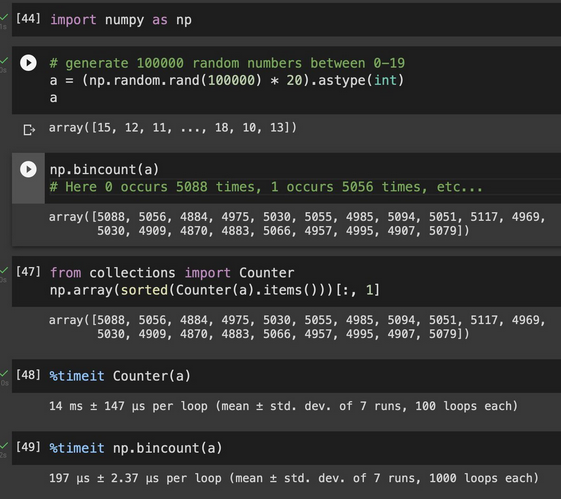

### :v: Make Pipeline into Pandas DataFrames
This means you can now do the `StandardScaler()` to the dataframe, and then return the scaled version of the dataframe for later use.

  

### :v: Python Numpy Tip: count the number of occurrence of each value in an array (not using counter)

  

### :v: Use Pipelines
* It improves data transformation process
* Cleaner code
* More robust
* Easier to deploy in production

  

