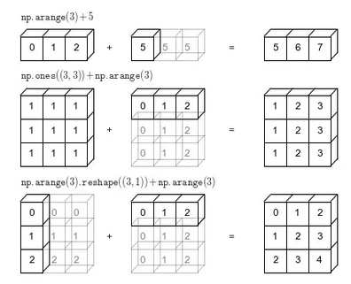

# Week 01

## Numpy Introduction:

Because data is growing exponentially every second of the time, data science popularity also increased, because we need many people to work on those data and find meaningful insights. Data science is a mixture of math, statistics, and computer science, problem solving, curosity, passionate to learn. Several tools exists to work on data projects, but python is rich and it is flexible, and it has large community, meaning you will be well guided to learn it.

Numpy is one of the primary packages along with others to do data science. We don't really directly interact with numpy but many packages are based on numpy as baseline. Numpy is fast and efficient to work on large datasets.

Comparing pyton list and numpy array, is not a good comparision, because, numpy array is way more efficient and faster. Because of this, almost all of the advanced packages doing ML borrows numpy data structure as their base-level.

When looking at dataset for the first time, make sure you remove the string + numbers mixed up data, for e.g. \$1200 should have removed in order to perform calculations on them. Also, numpy data-structure demands that all the data within a column of the dataset be the same-type.

## Load dataset with numpy
Numpy as allows to load csv files (better is by using pandas!)

```python
from numpy import genfromtxt

# First row is: id, airbnb_id, price, latitude, longitude
matrix_1 = genfromtxt(
    csv_unzipped_file_1, delimiter=";", skip_header=False, dtype="unicode"
)
matrix_2 = genfromtxt(
    csv_unzipped_file_2, delimiter=";", skip_header=False, dtype="unicode"
)
```
## change dimensions of matrix array

Sometimes we need to change the dimensions of the matrix

```python
np.ravel() # returns a view of numpy matrix collapsed into one dim
np.flatten() # returns a copy of numpy matrix collapsed into one dim
np.split() # provides sub-arrays, and tell which axis to split on
np.resize() # change the size of array
T or np.transpose() # inverst the axis of numpy matrix
np.flip()  # reverse the order of elements along the given axis
```

## merge two csv files

Data files are generally splitted into many small files (csv) we should merge them. Let's say we have two files named
```
Matrix 1 has dimensions:  (4097, 5) 
Matrix 2 has dimensions:  (2078, 5)
```
To merge, we use `np.concatenate` so total shape will be `(6175,5)`.

To merge:
```python
matrix = np.concatenate((matrix_1, matrix_2), axis=0)
print("Matrix has dimensions: ", matrix.shape)

# gives the desired shape now
```
`axis=0` ensures that the merging happens row-wise. i.e. we can think of stacking two datasets on top of each other. If we had `axis=1`, doesn't make sense here though, merging would happen side-by-side. also `concatenate` joins the matrix on the existing axis.

`np.stack()` joins numpy arrays by creating a new axis.

To select and view few entries:
```python
print(matrix[:5, :]) # row from 0:5, and all columns :
```

## slice and view matrix array

Other ways to view data from numpy array slicing:
```python
# Selection & slicing operations: [row], [row, columns], [row][column], [axis_0, axis_1, axis_2, ...], etc...
print("One entry\t\t\t:", matrix[6000])
print("One entry, a few elements\t:", matrix[6000, 1:3])
print("One element\t\t\t:", matrix[5000, 2])
print("One element\t\t\t:", matrix[5000][2])
```

## modify the matrix array
To drop first column:
```python
# Drop the first column
matrix = matrix[:, 1:]

# First five rows of updated matrix
print(matrix[:5, :])
```

Unicode data type means that it is a string. We need to change to float to be able to do math. But even before that, we need to get rid of pesky strings mixed up with numerical values as in \$1200. Since, we stacked two matrix, both of them has the header row, we need to get rid of. they are in loc: `matrix[0]` and `matrix[4097]`. So, how to delete these two rows?
```python
# Start with the highest index to prevent incorrect deletion
matrix = np.delete(matrix, (4097), axis=0)
matrix = np.delete(matrix, (0), axis=0)
```
Otherwise you will delete the wrong entry (i.e., once the top row is deleted, row 4097 becomes row 4096, so a different row 4097 will be deleted).

other related functions:
```python
np.insert() # insert a value into an existing numpy matrix
np.append() # add a value or row at the end of an existing numpy matrix
```
## remove commas, strings, dollar signs

Next let's work on removing commas, periods, and dollar signs attached into the numerical values.

We can do this:
```python
matrix[np.char.find(matrix, ",") > -1]

# this will give
array(['$1,036.00', '$1,160.00', '$1,290.00', '$2,000.00', '$1,200.00',
       '$1,975.00', '$1,600.00', '$1,200.00', '$1,000.00', '$1,000.00',
       '$1,000.00', '$1,000.00', '$1,000.00', '$1,000.00', '$2,350.00',
       '$1,186.00', '$1,194.00', '$2,500.00', '$1,000.00', '$1,000.00',
       '$1,000.00', '$1,000.00', '$1,000.00'], dtype='<U18')
```
other related methods:

```python
np.char.endswith() # find elements ending with specified characters
np.char.startswith() # find elements starting with specified characters
```

Can we remove command and dollar sign?
```python
matrix = np.char.replace(matrix, "$", "")
matrix = np.char.replace(matrix, ",", "")
```

Check if the above command removed what we wanted to remove:
```python
matrix[(np.char.find(matrix, "$") > -1) | (np.char.find(matrix, ",") > -1)]
```
No output, meaning it worked!

Finally, we can now convert to float from unicode using `astype(float)`
```python
matrix = matrix.astype(float)
```

Tips: if data appeared in scientific notation and it's hard to read, do this for easier to read
```python
# Disable scientific notation
np.set_printoptions(suppress=True)
```

## what is broadcasting in numpy array?

Broadcasting is a rich topic, and also very important concept. This helps to do the large numerical operations efficiently. If there were no vectorizing (and broadcasting) then, we would have to depend on the `for` loops to do the same operation, and that would be a huge complexity in terms of computational power and also time. see image below:


Broadcasting is a computationally and memoery-efficient way of calculating multiple equations at once, which is what we need for most machine learning algorithms.

Let's say we want to multiply second column of our matrix that contains the price, but now we also want to add the inflation of ~10\% to that price column only.
```python
# Add 10% to the prices by:
# - selecting a subset of the matrix
# - using broadcasting to multiply
matrix[:, 1] = matrix[:, 1] * 1.10
```
Some more related methods:
```python
* or np.multiply()  # multiply elements or matrices
/ or np.divide()  # divide elements or matrices
+ or np.add()  # sum elements or matrices
- or np.subtract()  # subtract elements or matrices
** or np.power()  # raise the first elemnent or matrix to the power
    # of the second element
% or np.remainder()  # get the remainder of the first-ordered element
  # or matrix, using second-ordered element as the divisor
// or np.floor_divide()  # divide two elements or matrices, with the
  # result rounded down to the nearest integer
    
np.sqrt() # calculate the square root of each element in the matrix
np.cos() # cosine of each element
np.sin()
np.tan()
np.absolute()
np.log()  # calcualte natural logarithm for each element in the matrix
np.exp()
```

## Conditional selection
`matrix[matrix[:,1]<20]` we select second column and see only those values that are less than 20, and use it as mask to select all other columns of the total matrix that satisfies the mask conditions.
```python
# Select rows for which the price_usd column is lower than 20
matrix[matrix[:, 1] < 20]
```
Some related methods:
```python
np.amin() # returns the min element of the matrix
np.amax()  # returns the max element of the matrix
np.sum()  # returns the sum of the matrix
np.average() # returns the mean/average of the matrix
np.median()  # return the median of the matrix
np.mean()  # return mean/avg of the matrix
np.var()  # return the variance of the matrix
np.std()  # return the standard deviation of the matrix
```

## Currency Converter
We need to add two more columns to our matrix; one that shows price in Indian currency and one for Chinese currency (we have USD given in data).
```python
from currency_converter import CurrencyConverter

cc = CurrencyConverter()
indian_rupee = cc.convert(100, "USD", "INR")
chinese_yuan = cc.convert(100, "USD", "CNY")

print("We have 100 dollars. When we convert it to:\n")
print("Indian rupees, we get:\t", indian_rupee)
print("Chinese yuan, we get:\t ", chinese_yuan)

# it shows:
We have 100 dollars. When we convert it to:

Indian rupees, we get:	 7984.660737483762
Chinese yuan, we get:	  686.2296392525233
```
Let's perform the conversion in a vectorize way. First define the function that does the conversion:
```python
def convert_usd_to_inr_or_cny(dollar: float, currency: str):
    if currency == "INR":
        return cc.convert(dollar, "USD", "INR")
    else:
        return cc.convert(dollar, "USD", "CNY")
```
Then, we can vectorize the function, then apply it to the matrix.
```python
%%timeit -r 4 -n 100

# (Semi-)vectorize a Python function
convert_vec = np.vectorize(convert_usd_to_inr_or_cny)

# Apply the function, use timeit
convert_vec(matrix[:, 1], "INR"), convert_vec(matrix[:, 1], "CNY")
```
This method of vectorizing and applying is much efficient and faster, had we have done it using typical `for` loop. But, it still lacks the true vectorize that numpy is capable of performing.
```python
%%timeit -r 4 -n 100

inr_rate = cc.convert(1, "USD", "INR")
cny_rate = cc.convert(1, "USD", "CNY")

matrix[:, 1] * inr_rate, matrix[:, 1] * cny_rate
```
In this small dataset, it didn't matter much, but always vectorize when dealing with the massive datasets or slow functions. **vectorization is worth it!**