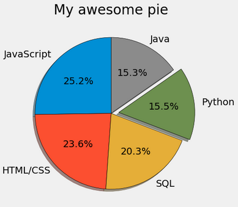

# Table of Content:
1. [Line Plot](#01.-line-plot-basic:)
2. [Bar Charts](#02.-bar-charts:)
3. [Pie Charts](#03.-pie-charts:)
4. [Stack Plots](#04.-stack-plots:)
5. [Histograms](#05.-histograms:)
6. [Scatter Plots](#06.-scatter-plots:)
7. [Plotting DateTime](#07.-plotting-dateTime-plot_date:)
8. [Plotting Data in Real Time](#08.-plotting-live-data-in-real-time:)
9. [Subplots](#09.-subplots:)

## Install matplotlib using `pip`:
```bash
pip install matplotlib              # to install for the first time
pip install --upgrade matplotlib    # to upgrade already installed ones
```

## Import package:
```python
import matplotlib.pyplot as plt
import numpy as np    # almost always in need
```

## Style of the Plot:
```python
plt.style.available                # to see what are available styles to choose from
plt.style.use('fivethirtyeight')   # to use one of available styles
```

## 01. Line Plot (Basic):
```python
# developer ages (x values)
dev_age = [25,26,27,28,29,30,31,32,33,34,35]   # list of ages
# median salaries (y values)
dev_salaries = [38496, 42000, 46752, 49320, 53200, 
            56000, 62316, 64928, 67317, 68748, 73752]

# plot it. 'label' argument helps to make legend later
# format strings
# fmt = '[marker][line][color]'. '--k' dash line color black
plt.plot(dev_age, dev_salaries, '--k' label='All Devs')
# same as above but format more explicit
plt.plot(dev_age, dev_salaries, color='k', linestyle='--', marker='*', linewidth=3, label='All Devs')

# now look for python dev
# Median Python Developer Salaries by Age
# same x-range in both plots, could use one
py_dev_x = [25, 26, 27, 28, 29, 30, 31, 32, 33, 34, 35]
py_dev_y = [45372, 48876, 53850, 57287, 63016,
            65998, 70003, 70000, 71496, 75370, 83640]

# plotting two lines in one plot
# color can be hex color codes: e.g. #5a7d9a, can find online for these
plt.plot(py_dev_x, py_dev_y, color='r', linestyle='-.', marker='o', label='Python Devs')

# Extra: --------------------------------------------------------------------------
# we can also utilize fill_between() and use conditions to fill the colors
# between the lines and see how colors change over x-range
# see docs/tutorial for the fill_between() part.
plt.fill_between(ages, py_salaries, dev_salaries,
                 where=(py_salaries > dev_salaries),
                 interpolate=True, alpha=0.25, label='Above Avg')

plt.fill_between(ages, py_salaries, dev_salaries,
                 where=(py_salaries <= dev_salaries),
                 interpolate=True, color='red', alpha=0.25, label='Below Avg')
# ---------------------------------------------------------------------------------

# add labels to axis and also title
plt.title("Median Salary (USD) by Age")
plt.xlabel('Ages')
plt.ylabel('Median Salary (USD)')

# add legend into the plot
plt.legend()

# to show gridlines
plt.grid(True)

# padding need sometime
plt.tight_layout()

# to save fig
plt.savefig('plot.png')

# to show the plot
plt.show()
```
The final output plot from above code comes out something like this.


## 02. Bar Charts:
We can try plotting the same data from above, but now with bar plots placing side-bys-side for different developers. This one is tricky here. We can just replace `plot()` with `bar()` but it will by default put the bars on top of each other. We want them to be side-by-side. We can specify the width of the bars and tell different bar to either shift left or right of that width value, so that when many bars are plotted then they will be shifted and so we can see them all side-by-side.
```python
# need to use numpy array for x values, but similar length as previous
# indexes was needed to make the offsets work
# to get the true x values, later we use xticklabels
x_indexes = np.arange(len(dev_age))
width = 0.25   # default is 0.8 (play to see what you like width to be)

y1_values = dev_salaries      # as above
y2_values = py_dev_salarires  # as above

# now do bar plot
plt.bar(x_indexes - width, y1_values, width=width, color='r', label='All Devs') # notice the shift in x_indexes
plt.bar(x_indexes, y2_values, width=width, color='b', label='Python')

# to make xticks, this will fix to true x values shown
plt.xticks(ticks=x_indexes, labels=dev_age)

# same with most of other stuffs (as above)
```
When you value large lists of values to plot in bar, then vertical bars won't be good, also because the labels in x axis won't have enough room to display as well So, in these scenarios if you need to make the bar plots, then make it **horizontal bar plots**. You just need `barh()` instead of `bar`; and adjust the labels as well. *Read docs for more*.

The final output plot from above code comes out something like this.


        
## 03. Pie Charts:
Just like bar charts, pie charts are used to display categorical values, but in proportions unlike bar charts they show total values in each bar. Don't use pie charts if you have more than 5 items to compare, it just makes your charts too crowded, in that case just use bar charts either horizontal or vertical ones.
```python
from matplotlib import pyplot as plt
plt.style.use('fivethirtyeight')

# Language Popularity: taking only 5 items
slices = [59219, 55466, 47544, 36443, 35917]
labels = ['JavaScript', 'HTML/CSS', 'SQL', 'Python', 'Java']
explode = [0,0,0,0.1,0]  # to emphasize any pie items

# for complete options you can check docs
plt.pie(
    slices,
    labels=labels,
    explode=explode,
    shadow=True,
    startangle=90,     # rotates pie items
    autopct='%1.1f%%', # to show % in items
    wedgeprops={'edgecolor':'black'}
)

plt.title("My awesome pie")
plt.show()

# Colors:
# using hex color codes make look more professional
# Blue = #008fd5
# Red = #fc4f30
# Yellow = #e5ae37
# Green = #6d904f
```
The final output plot from above code comes out something like this.

        
        
## References:
* [Matplotlib Tutorials from Corey Schafer](https://www.youtube.com/playlist?list=PL-osiE80TeTvipOqomVEeZ1HRrcEvtZB_)

## 04. Stack Plots:
Scene: How much each players/developers worked on the game/project in total minutes/days of 8. Stack plots are good to do comparison between items/people/things over the span of times.
```python
from matplotlib import pyplot as plt
plt.style.use("fivethirtyeight")

# time-period. could be days/months, etc.
minutes = [1, 2, 3, 4, 5, 6, 7, 8, 9]

# people we are comparing
player1 = [8, 6, 5, 5, 4, 2, 1, 1, 0]
player2 = [0, 1, 2, 2, 2, 4, 4, 4, 4]
player3 = [0, 1, 1, 1, 2, 2, 3, 3, 4]

labels = ['player1', 'player2', 'player3']
# hex colors makes plot look professional
colors = ['#6d904f', '#fc4f30', '#008fd5']

plt.stackplot(minutes, player1, player2, player3, 
              labels=labels, 
              colors=colors
)

plt.legend(loc=(0.07, 0.05))
plt.title("My Awesome Stack Plot")
plt.tight_layout()
plt.show()

# Colors:
# Blue = #008fd5
# Red = #fc4f30
# Yellow = #e5ae37
# Green = #6d904f
```

The final output plot from above code comes out something like this.


## 05. Histograms:
Histograms are great to visualize the distribution of data where data falls within certain boundaries. We can divide the range of total boundaries into bins and see how many of those data points falls within bins.
```python
import pandas as pd
from matplotlib import pyplot as plt
plt.style.use('fivethirtyeight')

ages = [18, 19, 21, 25, 26, 26, 30, 32, 38, 45, 55]
bins = [10 , 20, 30, 40, 50, 60]

# if our data was in csv file
data = pd.read_csv('data.csv')
ids = data['Responder_id']
ages = data['Age']

# hist parameters: (log=True) , to plot in log scale
# if some bins has too large number that other bins
# values won't show, you need to plot in log-scale
plt.hist(ages, bins=bins, edgecolor='black')

# let's see a vertical line where median age falls
median_age = 29
color = '#fc4f30'

# to plot a vertical line to see where some value lies in histogram
plt.axvline(median_age, color=color, label='Age Median', linewidth=2)

plt.legend()

plt.title('Ages of Respondents')
plt.xlabel('Ages')
plt.ylabel('Total Respondents')
plt.tight_layout()
plt.show()
```

The final output plot from above code comes out something like this.


## 06. Scatter Plots:
Scatter plots are used to show the relationship between two variables, and see how they are correlated or not. We can also see trends or not, outliers, etc. In this plot below we didn't see any correlations.
```python
import pandas as pd
from matplotlib import pyplot as plt
plt.style.use('fivethirtyeight')

# two variables to see the relationship/correlation, if exist
x = [5, 7, 8, 5, 6, 7, 9, 2, 3, 4, 4, 4, 2, 6, 3, 6, 8, 6, 4, 1]
y = [7, 4, 3, 9, 1, 3, 2, 5, 2, 4, 8, 7, 1, 6, 4, 9, 7, 7, 5, 1]

# to show the strength of each data point
# this could be how much satisfied customers are
colors = [7, 5, 9, 7, 5, 7, 2, 5, 3, 7, 1, 2, 8, 1, 9, 2, 5, 6, 7, 5]

# size of each points, could use another variable as a way to make size
# just like color strengths of the points
sizes = [209, 486, 381, 255, 191, 315, 185, 228, 174,
          538, 239, 394, 399, 153, 273, 293, 436, 501, 397, 539]

plt.scatter(x, y, c=colors, cmap='summer', s=sizes,
           edgecolor='black', linewidth=1,
           alpha=0.75
)

# color bar needed to understand what color intensity means
# since we use color as one of the measures as well
cbar = plt.colorbar()
cbar.set_label('Satisfaction level')

# if data was in some csv files:
# data = pd.read_csv('2019-05-31-data.csv')
# view_count = data['view_count'] in x-axis
# likes = data['likes'] in y-axis
# ratio = data['ratio'] colors

# due to some outliers general trend might hide
# in that case, better to see in log-scales
# for one or both axes
plt.xscale('log')
plt.yscale('log')

plt.title('Trending YouTube Videos')
plt.xlabel('View Count')
plt.ylabel('Total Likes')
plt.tight_layout()
plt.show()
```

The final output plot from above code comes out something like this.


## 07. Plotting DateTime `plot_date`:
Whenever you have datetime object in your dataframe, and you want to make time-series plot then, you can plot using this method.
```python
import pandas as pd
from datetime import datetime, timedelta
from matplotlib import pyplot as plt
from matplotlib import dates as mpl_dates

plt.style.use('fivethirtyeight')

dates = [
    datetime(2019, 5, 24),
    datetime(2019, 5, 25),
    datetime(2019, 5, 26),
    datetime(2019, 5, 27),
    datetime(2019, 5, 28),
    datetime(2019, 5, 29),
    datetime(2019, 5, 30)
]

# y-values
y = [0, 1, 3, 4, 6, 5, 7]

plt.plot_date(dates, y, linestyle='solid')

# getting current figure object from the pyplot,
# and then formatting date for the dates to look better
plt.gcf().autofmt_xdate()

# let's better format how dates are shown
# details of formatting, look into docs
date_format = mpl_dates.DateFormatter('%b, %d %Y')

# get current axis, xaxis, then change
# how the dates are shown using date formatter
plt.gca().xaxis.set_major_formatter(date_format)

# ----------------------------------------------------------------
# if we want to use datetime from dataframe, then this is the way
data = pd.read_csv('data.csv')
price_date = data['Date']
price_close = data['Close']

# Since date obj from dataframe are read as String
# we need to change it to datetime object first:
data['Date'] = pd.to_datetime(data['Date'])

# Then, sort the values, because that is how datetime is plotted
data.sort_values('Date', inplace=True)

plt.title('Bitcoin Prices')
plt.xlabel('Date')
plt.ylabel('Closing Price')

plt.tight_layout()
plt.show()
```

The final output plot from above code comes out something like this.


## 08. Plotting Live Data in Real-Time:
Online-Monitoring of the plots as the data comes in regular interval from some database outside is a common task in many places. The dataframe or csv file is constantly being updated as new data comes in and we should monitor the plots based on the updated data.
```python
import random
from itertools import count
import pandas as pd
import matplotlib.pyplot as plt
from matplotlib.animation import FuncAnimation

plt.style.use('fivethirtyeight')

# emplty lists that will get update continuously,
# for example
x_vals = []
y_vals = []

# counts from 1 to n...
index = count()

# this function will be called continously,
# so plots will update accordingly,
# need to clear figure now to not color change
# but there is good way to do clearings
def animate(i):
    x_vals.append(next(index))
    y_vals.append(random.randint(0, 5))
    
    plt.cla()  # to clear previous plot
    plt.plot(x_vals, y_vals)

# FuncAnimation will constantly call the above function
# get current figure from plt, 1000ms = 1sec
anim = FuncAnimation(plt.gcf(), animate, interval=1000)

plt.tight_layout()
plt.show()
#------------------------------------------------------------------------
# now lets see how this works in real-world case:

# let's say this 'data.csv' file is being constantly being updated coming
# from outside, let's say its col names are as given below:

# again define animate func that does plotting continously
def animate(i):
    data = pd.read_csv('data.csv')
    x = data['x_value']
    y1 = data['total_1']
    y2 = data['total_2']
    
    plt.cla()
    plt.plot(x, y1, label='channel 1')
    plt.plot(x, y2, label='channel 2')
    
    plt.legend(loc='upper left')
    plt.tight_layout()
    
anim = FuncAnimation(plt.gcf(), animate, interval=1000)

plt.tight_layout()
plt.show()
```
We don't have the plot for this part because the plots are continously being updated and so we can't show them. Please refer more to learn how `FuncAnimation` from matplotlib works for all the other features and capabilities it can do. For the example above, there is a python script that generates data continously when it is started to run, until it is stopped, after running that python script and data continously generating, we can then run our anim here, that will run the animate function in iterval of 1 sec here, and we can monitor the plots. In even more real world, the data comes from sensor, or detectors, so the csv/data is continously updated there, and this file above, just needs to collect data from that file, and run the animation and do online-monitoring.

## 09. Subplots:
Up until now, we have been using pyplot plots for single plots and that works fine. But if we need additional plots, or work on multiple plots within the single canvas/figure object, also if we need to work in more like the *object oriented* way, then **subplots** are needed. But, of course, even to create single plot, we can use this way as well.

To do Object-Oreinted manner: figure is whole canvas where we make plots on, axes is a plot in the figure, so a figure can have a multiple axes or plots in them.
```python
import pandas as pd
from matplotlib import pyplot as plt

plt.style.use('fivethirtyeight')

# read the data from csv using pandas
data = pd.read_csv('data.csv')
ages = data['Age']
dev_salaries = data['All_Devs']
py_salaries = data['Python']
js_salaries = data['JavaScript']

# Older way:
#=======================================================
plotting on same figure object as we did before
plt.plot(ages, py_salaries, label='Python')
plt.plot(ages, js_salaries, label='JavaScript')
plt.plot(ages, dev_salaries, color='#444444',
         linestyle='--', label='All Devs')

plt.legend()

plt.title('Median Salary (USD) by Age')
plt.xlabel('Ages')
plt.ylabel('Median Salary (USD)')

plt.tight_layout()
plt.show()

# if we want one single plot
# ================================================================
fig, ax = plt.subplots()      # defaults to 1x1 axes, (1r, 1c)

ax.plot(ages, py_salaries, label='Python')
ax.plot(ages, js_salaries, label='JavaScript')
ax.plot(ages, dev_salaries, color='#444444',
         linestyle='--', label='All Devs')

ax.legend()
ax.set_title('Median Salary (USD) by Age')
ax.set_xlabel('Ages')
ax.set_ylabel('Median Salary (USD)')
# ====================================================

# if we want multiple plots within one figure object
# sharex will only make tick to bottom row for one col
# sharey will only make tick to leftmost for two col
fig, (ax1, ax2) = plt.subplots(2,1, sharex=True)

ax1.plot(ages, dev_salaries, color='#444444',
         linestyle='--', label='All Devs')
ax2.plot(ages, py_salaries, label='Python')
ax2.plot(ages, js_salaries, label='JavaScript')

ax1.legend()
ax1.set_title('Median Salary (USD) by Age')
# ax1.set_xlabel('Ages')  since bottom ones has same xaxis names
ax1.set_ylabel('Median Salary (USD)')

ax2.legend()
# ax2.set_title('Median Salary (USD) by Age')  since same title
ax2.set_xlabel('Ages')
ax2.set_ylabel('Median Salary (USD)')

plt.tight_layout()
plt.show()

# if we want separate figure, separate axes for each figure then 
# ======================================
fig1, ax1 = plt.subplots()
fig2, ax2 = plt.subplots()

ax1.plot(ages, dev_salaries, color='#444444',
         linestyle='--', label='All Devs')

ax2.plot(ages, py_salaries, label='Python')
ax2.plot(ages, js_salaries, label='JavaScript')

ax1.legend()
ax1.set_title('Median Salary (USD) by Age')
ax1.set_ylabel('Median Salary (USD)')

ax2.legend()
ax2.set_xlabel('Ages')
ax2.set_ylabel('Median Salary (USD)')
#----------------------------------------------
```

The final output plot from above code doing multiple plots in a same figure object comes out something like this.

