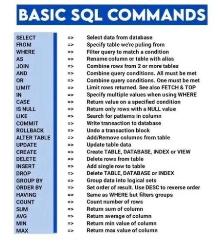

# Structured Query Language SQL:
Talks with the databases like:
* SQL Server
* Oracle
* MySQL, etc.

Tools to Write SQL
* SQL Server Management Studio
* SQL Workbench
* SQL developer
* TOAD, etc.

A table in SQL is a type of entity (i.e. Dogs), and each row in that table as a specific *instance* of that type (i.e. A pug, a beagle, a different colored pug, etc.). This means that the columns would then represent the common properties shared by all instances of that entity (i.e. Color of fur, length of tail, etc.)

## Create Database:
```sql
CREATE DATABASE name;    /* this command creates database */
USE name;                /* USE activates the database */
```

## `SELECT` queries:
`SELECT` is used to retrieve data from SQL database, and it is also colloquially called as *queries*. Queries contains mainly -> what data we are looking for, where to find it in the database, and optionally transform it before returning.
```sql
/* Select query for a specific multiple columns */
SELECT column, another_col
FROM myTable;

/* to select all the columns from a table */
SELECT *
FROM myTable;
```

## Queries with Constraints `WHERE` clause, `LIKE`, and `IN`:
The `WHERE` clause is applied to each row of data by checking specific column values to determine whether it should be included in the results or not.
```sql
/* Select query with constraints */
SELECT col1, col2
FROM myTable
WHERE condition
    AND/OR another_condition
    AND/OR ....;
    
/* example */
SELECT *
FROM myTable
WHERE col2='value';

/* using IN (same as above) */
SELECT *
FROM myTable
WHERE col2 IN ('value');

SELECT *
FROM myTable
WHERE col2 NOT IN ('value'); /* everything other that one value from col2 */

/* real examples */
SELECT * FROM Country;
SELECT Name, Continent, Population FROM Country 
  WHERE Population < 100000 ORDER BY Population DESC;
  
SELECT Name, Continent, Population FROM Country 
  WHERE Population < 100000 OR Population IS NULL ORDER BY Population DESC;
  
SELECT Name, Continent, Population FROM Country 
  WHERE Population < 100000 AND Continent = 'Oceania' ORDER BY Population DESC;
  
/* % wild card anything before and after is okay */
/* _a% first letter can be anything, second a and anything after */
SELECT Name, Continent, Population FROM Country 
  WHERE Name LIKE '%island%' ORDER BY Name;
  
/* same like .isin() in python */
SELECT Name, Continent, Population FROM Country 
 WHERE Continent IN ( 'Europe', 'Asia' ) ORDER BY Name;
```
Some more complex queries can be made by combining several of ANDs and ORs as shown below:

<p align="center">
    
</p>


When doing `WHERE` clauses with the columns containing text data, we have several more sql commands to do selection of the values in the column that works with the strings. See below:

<p align="center">
    
</p>


## Conditional expressions when querying:
Sometimes we want to query if a col value is one thing or another, and do something based on conditions. Just like if else statements in python.
```sql
CREATE TABLE booltest (a INTEGER, b INTEGER);
INSERT INTO booltest VALUES (1, 0);
SELECT * FROM booltest;

/* testing if a ,b is either True of False and asking to print corresponding string */
SELECT
    CASE WHEN a THEN 'true' ELSE 'false' END as boolA,
    CASE WHEN b THEN 'true' ELSE 'false' END as boolB
    FROM booltest
;

/* testing if a, b is specific values or not */
SELECT
  CASE a WHEN 1 THEN 'true' ELSE 'false' END AS boolA,
  CASE b WHEN 1 THEN 'true' ELSE 'false' END AS boolB 
  FROM booltest
;
```

## Filtering and Sorting Query Results:
`DISTINCT` keyword will discard rows that have a duplicate column value.
```sql
/* removes every rows for col1, col2 has same values, need to discard duplicates based on
specific columns then we need to use GROUP BY clause */
SELECT DISTINCT col1, col2
FROM myTable
WHERE condition(s);

/* examples */
SELECT Continent FROM Country;
SELECT DISTINCT Continent FROM Country; /* finds all distinct values in Continent col */

SELECT DISTINCT a,b FROM test; /* shows distinct combinations of a & b col values */
```

### Ordering results with `ORDER BY`:
```sql
SELECT col1, col2
FROM myTable
WHERE condition(s)
ORDER BY col1 ASC/DESC;

/* examples */
SELECT Name FROM Country;
SELECT Name FROM Country ORDER BY Name;
SELECT Name FROM Country ORDER BY Name DESC;
SELECT Name FROM Country ORDER BY Name ASC;
SELECT Name, Continent FROM Country ORDER BY Continent, Name; /* first order by Continent, then Name */
/* here, we order DESC by Continent, then Region, Name ASC (by default) */
SELECT Name, Continent, Region FROM Country ORDER BY Continent DESC, Region, Name;
```
When an `ORDER BY` clause is specified, each row is sorted alpha-numerically based on the specified column's value.

### Limiting results to a subset using `LIMIT` and `OFFSET`:
The `LIMIT` wll reduce the number of rows to return, and the optional `OFFSET` will specify where to begin counting the number of rows from.
```sql
SELECT col1, col2
FROM myTable
WHERE condition(s)
ORDER BY col1 ASC/DESC
LIMIT num_limit OFFSET num_offset;
```

## Counting rows:
Instead of listing the output/result of the query as tables, which is what we mostly want to do anyway, we can also `COUNT` the rows/instances of our queries:
```sql
SELECT COUNT(*) FROM myTable;       /* counts total rows in myTable */
SELECT COUNT(*) FROM Country WHERE Population > 100000000 AND Continent = 'Europe'; /* count with conditions */
```

## Multi-table queries with `JOINS`:
Of course in the real world, we don't just have the single table, but data closely related are spread across several tables, and we should be able to access from multiple tables.

Tables that share information about a single entity need to have a *primary key* that identifies that entity *uniquely* across the database.

### Let's see **INNER JOIN** type of join:
```sql
/* select query with INNER JOIN on multiple tables */
SELECT col1, another_table_col2, ...
FROM myTable
INNER JOIN anotherTable
    ON myTable.id = anotherTable.id
WHERE condition(s)
ORDER BY col, ... ASC/DESC
LIMIT num_limit OFFSET num_offset;

/* examples */
/* l,r are an alias we can define later in second line */
SELECT l.description AS left, r.description AS right /* since both col same name, so we give alias */
  FROM left AS l
  JOIN right AS r ON l.id = r.id;
  
SELECT s.id AS sale, i.name, s.price 
  FROM sale AS s
  JOIN item AS i ON s.item_id = i.id
  ;

SELECT s.id AS sale, s.date, i.name, i.description, s.price 
  FROM sale AS s
  JOIN item AS i ON s.item_id = i.id
  ;
  
/* sometimes, we need to query data from more than 2 tables */
/* let's say we have 3 tables, Junction Table */
SELECT * FROM customer;
SELECT * FROM item;
SELECT * FROM sale;

SELECT c.name AS Cust, c.zip, i.name AS Item, i.description, s.quantity AS Quan, s.price AS Price
  FROM sale AS s
  JOIN item AS i ON s.item_id = i.id
  JOIN customer AS c ON s.customer_id = c.id
  ORDER BY Cust, Item
;

-- a customer without sales
INSERT INTO customer ( name ) VALUES ( 'Jane Smith' );
SELECT * FROM customer;

-- left joins
SELECT c.name AS Cust, c.zip, i.name AS Item, i.description, s.quantity AS Quan, s.price AS Price
  FROM customer AS c
  LEFT JOIN sale AS s ON s.customer_id = c.id
  LEFT JOIN item AS i ON s.item_id = i.id
  ORDER BY Cust, Item
;
```

### OUTER JOINS:
In the inner joins, resulting table only contains data that belongs in both of the tables. But, most of the time, data won't be symmetric, in that case, in order to not lose data from any of the joined tables, we need to use either `LEFT JOIN`, `RIGHT JOIN`, or `FULL JOIN`.
```sql
/* Select query with LEFT/RIGHT/FULL JOINs on multiple tables */
SELECT col1, another_table_col, ...
FROM myTable
INNER/LEFT/RIGHT/FULL JOIN another_table
    ON myTable.id = another_table.matching_id
WHERE condition(s)
ORDER BY col, ... ASC/DESC
LIMIT num_limit OFFSET num_offset;
```

See image below for more on joins:

<p align="center">
    
</p>

## Dealing with `NULL`:
`NULL` values arises in several cases, when we try to outer join two asymmetric tables, for example. We can test whether a column contains any `NULL` values or not using `WHERE` clause together with `IS NULL` or `IS NOT NULL` constraints.
```sql
/* Select query with constraints on NULL values */
SELECT col1, col2, ...
FROM myTable
WHERE col1 IS/IS NOT NULL
AND/OR another_condition
AND/OR ...;
```

## Queries with mathematical/logical expressions:
In addition to doing simple raw column queries, if possible (if values in col permits), we can also add complex mathematical and other logical expressions to make our query even more interesting.
```sql
/* see example of this physics db */
SELECT particle_speed / 2.0 AS half_particle_speed
FROM physics_table
WHERE ABS(particle_position) * 10.0 > 500.0;
```

## Queries with **aggregates**:
Aggregates functions are used to summarize the columns or group of rows of data. Its syntax looks like:
```sql
/* select query with aggregate functions over all rows */
SELECT AGG_FUNC(col_or_expr) AS agg_description, ...
FROM myTable
WHERE contraint;

/* with grouped aggregate: apply agg func to individual group */
SELECT AGG_FUNC(col_or_expr) AS agg_description, ...
FROM myTable
WHERE constraint
GROUP BY col;
```
Some of the common aggregate functions are:

<p align="center">
    
</p>

When we used `GROUP BY` above, we used it at the end, before `WHERE` clause. Then, how can we further do the filtering after having the grouped rows. We do this by using `HAVING` clause to do filter after group by objects have formed.
```sql
/* select query with HAVING constraint */
SELECT group_by_col, AGG_FUNC(col_expr) AS agg_result_a
FROM myTable
WHERE condition(s)
GROUP BY column
HAVING group_condition;
```
>The constraints/conditions that we can use after `HAVING` clause is similarly written as you would with `WHERE` clause.

## **Order of Execution** of a query & a Complete query:
Let's first see how all the parts of clause fit in, i.e. a complete picture:
```sql
/* complete SELECT query */
SELECT DISTINCT column, AGG_FUNC(column_or_expression), …
FROM mytable
    JOIN another_table
      ON mytable.column = another_table.column
    WHERE constraint_expression
    GROUP BY column
    HAVING constraint_expression
    ORDER BY column ASC/DESC
    LIMIT count OFFSET COUNT;
```
Each part of the query is executed sequentially. See [sqlbolt](https://sqlbolt.com/lesson/select_queries_order_of_execution) for more details, but in short, the clause order of execution is as follows:
1. `FROM` and `JOIN` s: to determine the total working set of data
2. `WHERE`
3. `GROUP BY`
4. `HAVING`
5. `SELECT`
6. `DISTINCT`
7. `ORDER BY`
8. `LIMIT / OFFSET`

## How to **Create Tables** to put into the Database?
We can directly import `.csv` files into the database as a table with the data import wizard found in *mysql workbench*, and I think that will be the most efficient way to import table and put into database, then play your sql queries on them. Nonetheless, we can manually also add tables and so on. Let's see how. We can add tables into DB using `CREATE TABLE` statements.
```sql
/* create table */
/* default will let the col to take defualt value if not provided. */
CREATE TABLE IF NOT EXISTS myTable (
    col1 data_type table_constraint DEFAULT default_value,
    col2 data_type table_constraint DEFAULT default_value,
    ...
);

/* create table col with some constraints */
CREATE TABLE test ( a TEXT, b TEXT, c TEXT NOT NULL ); /* ensures col c is not NULL */
CREATE TABLE test ( a TEXT, b TEXT, c TEXT DEFAULT 'panda' ); /* takes default value if not provided later */
CREATE TABLE test ( a TEXT UNIQUE, b TEXT, c TEXT DEFAULT 'panda' ); /* UNIQUE don't allow duplicates */
CREATE TABLE test ( a TEXT UNIQUE NOT NULL, b TEXT, c TEXT DEFAULT 'panda' );

/* more examples */
/* PRIMARY KEY automatically creates id (starts from 1) for all rows */
/* a table can only have PRIMARY KEY col , works in sqlite3 system */
/* id col will populate itself, just add values for other col */
CREATE TABLE movies(
    id INTEGER PPRIMARY KEY,   /* PRIMARY KEY is a contraint to make values in col unique */
    title TEXT,
    director TEXT,
    year INTEGER,
    length_minutes INTEGER
);

/* create and fill table */
CREATE TABLE test (
  a INTEGER,
  b TEXT
);

INSERT INTO test VALUES ( 1, 'a' );
INSERT INTO test VALUES ( 2, 'b' );
INSERT INTO test VALUES ( 3, 'c' );
SELECT * FROM test;
```
Different DB supports different data types as a table column, but common ones are numeric types (double, float), string, booleans, dates, etc. See below image for more info:

<p align="center">
    
</p>

## Inserting, Updating, Deleting Rows in table:
```sql
INSERT INTO myTable
  VALUES (value _or_expr, another_value _or_expr, ...),
       (value _or_expr, another_value _or_expr, ...),
       ...;
       
/* Insert statement with specific columns */
INSERT INTO mytable (column, another_column, …)
  VALUES (value_or_expr, another_value_or_expr, …),
       (value_or_expr_2, another_value_or_expr_2, …),
      …;
      
/* Example Insert statement with expressions */
INSERT INTO boxoffice (movie_id, rating, sales_in_millions)
  VALUES (1, 9.9, 283742034 / 1000000);

INSERT INTO customer (name, address, city, state, zip) 
  VALUES ('Fred Flintstone', '123 Cobblestone Way', 'Bedrock', 'CA', '91234');
  
/* if we only insert on few columns of a row, then we get NULL on rest col */
INSERT INTO customer (name, city, state) 
  VALUES ('Jimi Hendrix', 'Renton', 'WA');
  
/* more insert into examples */
INSERT INTO test VALUES ( 1, 'This', 'Right here!' ); 
INSERT INTO test ( b, c ) VALUES ( 'That', 'Over there!' ); /* only inserting into certain cols */ 
INSERT INTO test DEFAULT VALUES; /* all the values for this row will be NULL */
INSERT INTO test ( a, b, c ) SELECT id, name, description from Item_table; /* using select of another table */

/* =============================== */
/* Update statement with values */
UPDATE mytable
  SET column = value_or_expr, 
    other_column = another_value_or_expr, 
    …
  WHERE condition;
  
/* update table/row example */
UPDATE customer SET address = '123 Music Avenue', zip = '98056' WHERE id = 5; /* id col to specify row */
UPDATE customer SET address = '2603 S Washington St', zip = '98056' WHERE id = 5; /* change again */
UPDATE customer SET address = NULL, zip = NULL WHERE id = 5; /* finally make NULL back to it */

/* ================================ */
/* Delete statement with condition */
DELETE FROM mytable
  WHERE condition;
  
/* first select and see if what you see is what you want to delete */
SELECT * FROM customer WHERE id = 4;
DELETE FROM customer WHERE id = 4;

SELECT * FROM customer; /* to see that row is deleted */
```


## The `NULL` value:
`NULL` is special in that it lacks the value, it is a state where there is no value not even empty string, zero. Below we will see how `NULL` behaves in different situations:
```sql
/* first see the test table */
SELECT * FROM test;
/* because NULL is absence of value */
SELECT * FROM test WHERE a = NULL;    /* throws an error */
SELECT * FROM test WHERE a IS NULL;   /* this is how we can check for NULL */
SELECT * FROM test WHERE a IS NOT NULL;
INSERT INTO test ( a, b, c ) VALUES ( 0, NULL, '' ); /* this is okay, you can add NULL */
SELECT * FROM test WHERE b IS NULL;
SELECT * FROM test WHERE b = ''; /* error */
SELECT * FROM test WHERE c = '';
SELECT * FROM test WHERE c IS NULL; /* error */

DROP TABLE IF EXISTS test; /* delete above table */

/* create table with constraints that a,b col can't be NULL */
CREATE TABLE test (
  a INTEGER NOT NULL,
  b TEXT NOT NULL,
  c TEXT
);

INSERT INTO test VALUES ( 1, 'this', 'that' ); /* this passes */
SELECT * FROM test;

INSERT INTO test ( b, c ) VALUES ( 'one', 'two' ); /* error, a can't be NULL */
INSERT INTO test ( a, c ) VALUES ( 1, 'two' ); /* error, b can't be NULL */
INSERT INTO test ( a, b ) VALUES ( 1, 'two' ); /* this is fine, c can be NULL */
DROP TABLE IF EXISTS test; /* finally, deleting the test table */
```

## Altering tables:
With time, the table constraints might change, you need to update tables, or add new columns, or change data types of the columns. You can do those using `ALTER TABLE` statement.

```sql
/* adding column */
ALTER TABLE myTable
ADD col3 data_type;

/* removing column */
ALTER TABLE myTable
DROP col3;

/* renaming the table */
ALTER TABLE myTable
RENAME TO new_table_name;
```

## Delete / Dropping tables:
In rare cases, you might have to totally delete table from DB, you can use `DROP TABLE` statement.
```sql
DROP TABLE IF EXISTS myTable;

DROP TABLE test;
DROP TABLE IF EXISTS test;
```

## Cheat-Sheet found from web:
List of some of the basic commands:

<p align="center">
    
</p>

## Resources:

* [SQLBolt](https://sqlbolt.com/)
* [MySQL Docs](https://dev.mysql.com/doc/)
* [SQL Essential Training (LinkedIn)](https://www.linkedin.com/learning/sql-essential-training-3)