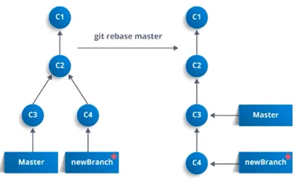

## To install git in Ubuntu/Linux:
```bash
sudo apt install git
```

## configure the global/initial settings:
This will allow others in the collaboration to recognize you. You change this once and done for all time!
```bash
## to make the settings:
git config --global user.name "your_username"               # username will be see by others
git config --global user.email "your_email@email.com"       # this email will be used to recognize you

## to check if you have already done:
git config --global user.name                               # should show you your username that has set
git config --global user.email                              # shows your email that has set

# to see how Git is configured:
git config --list --system
git config --list --global
git config --list --local

## to change your main branch name to "main" (if default, master)
git branch -M main
```

## Starting from your local machine/terminal (from scratch):
```bash
git init             # initializes git so that your changes will be tracked
                     # it creates hidden .git folder
                     
git status           # checks if there are any changes that needs tracked
                     # this is first time, so nothing here to track or tracked before
                     
# do you coding, changes and so on:
git status           # now you should see one or many untracked files
                     # you can have .gitignore file if you want some file types, folders that
                     # you don't want git to track, these includes some library files, some auto-generated
                     # files, or whatever!
                     
git add .            # adds all the files that has changes, newly added (if not in .gitignore), etc to the
                     # staging area, which is then can be committed as permanent changes
                     
git add file_name    # or you can specify which file(s) you want git to track for you.

# if you didn't intend to add this file:
git reset HEAD      # to go to the previous commit state

git rm --cached <file>    # to unstage the file if git has been tracking them
                          # you can then add them into your .gitignore file to permanently untrack them

# you can still change the files or add other files do your work here, before commit. Once you are done
# or done for that day/session, you can then add again. then you can commit
git commit -m "meaningful_message"

# if you already have the files tracked, and only changes are made to those files only. i.e. no new files
# has been added, then, you have a shortcut to add and commit in one-line
git commit -am "message_to_commit"      # notice -am option that does the trick

# if you accidently mistyped a commit message, you can change the last commit using the `--amend` flag
git commit --amend -m "new message"

# how to see what history of commits we have
git log

# how to see more info about any of the commits?
git show <commit_id/hash_id>

# to see what changed between two commits? compare two hash
git diff ID1..ID2         # note double .. is needed
git diff HEAD~1..HEAD~3   # HEAD points to the last commit

# how to list all the files currently git is tracking in the repository?
git ls-files

# how to link this to the github newly created repo to push our changes
# first create new-repo in github, then copy the address in http or ssh
# add it as a remote with alias origin
git remote add origin <url_to_github_repo>

# how to check, if our local repo is linked with remote repo?
git remote -v      # this will show (fetch) and (push) both to same origin

## how to change the remote name from orgin to repo specific names?
git remote rename origin <repo_specific_name>

## how to remove remote if you no longer needed?
git remote rm origin

# now, how to send changes from local to remote?
git push <remote_alias> <branch>
git push -u origin master
> Username:         # asks your passowrd and so on
> Password:
```

## Parallel development, creating new branches for several features:
```bash
# first, see in which branch you are in.
# it will list all branches, with * in which you are currently in
git branch
git status    # alternative way to see which branch you in

# how to create new-branch and do dev.
git brach <br_name>

## how to delete branch after done dev.
git branch -d <br_name>

# list branches, again
git branch

# how to switch to branch you create
git checkout <br_name>

## branches contains all the commits history the master branch has

## now make changes into files in this branch, add new files, modify ,etc.

# add and commit the changes to the branch

# how to see log, or number of commits in the particular branch
git log <br_name>

## once, all the dev. work in particular branch is finished, it needs to be merge
## to the master branch

## first go to the master/main branch
git checkout master/main

# now do the merge
git merge <br_name>

## now you can check log, ls-files to verify merge
```

## Rebase, another way of merging branch commits:
Rebase is used when changes made in one branch needs to be reflected in another branch. It will make your commit history clean and is the preferred way to do the merge. See below



```bash
# create new branch for this purpose
git branch <rebase_branch>

git checkout <rebase_branch>   # to move to this branch

git log     # will show all the commits associated with the master

## make changes, do commits and so on to make dev.

git log --oneline            # shows commit history in one line

git log --oneline master     # commits in master branch or any branch you specify

## now lets go into master and do some changes and make a commit
git checkout master
git add .
git commit -m "message"

## check your log looks like in master and rebase branch
## you will see both main and rebase branch has moved one (or more) commit(s) ahead of original state
# when rebase was first created

## since, our master has moved ahead with the commits, our rebase branch doesn't have that new commits
# as it's master, it needs to update to latest commits in master to update rebase branch master

# first go to the rebase branch
git checkout rebase_branch

git rebase master     # latest commits of master branch will be the base for this rebase branch
                       # for linear one-line log history
```

## Important Questions one might have:
```bash
## Whenever you fork other's repo, the repo in your account is called "downstream", and the
# remote repo is called "upstream".
# To sync changes made in upstream repo into your downstream repo, you still need to configure
# a remote that points to upstream rep
git remote -v        # this should already have been configured to your account downstream repo
                     # as the origin remote
# this will create upstream remote pointing to original repo
# just like creating origin remote, here upstream is just the name, you could name it whatever suits
git remote add upstream <original_rep_url_https/ssh>

# to sync with upstream
git merge upstream/master

## once you fork, clone your forked repo, make changes, codes, etc. then push the changes to your
# forked repo, then finally if you want you can start a pull request to suggest the changes
```

### How to remove all the unwanted files that are committed and you want to unstage them to untrack now on?
You can tell git to mark them as deleted (without actually deleting them) with:
```bash
git rm --cached -r .          # . means all the files
```
`--cached` will remove the path of files from staging area without removing files itself. `-r` to do recursively. Once your staging is clean, then the files that you don't want to put into stage area again, then put those files, path, or file types into the `.gitignore` now that if you add, it won't add those into the staging area. Next will be to do:
```bash
git add .
git commit -m "clean staging area"
```

Also, see the following Git Cheat Sheet!


